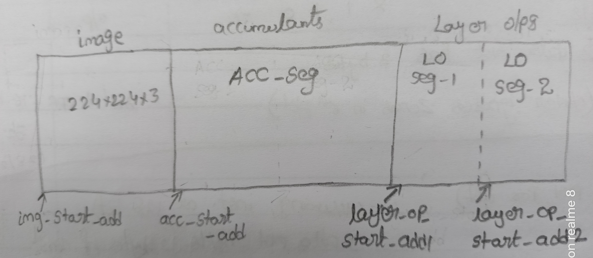

DDR Layout and accessing
########################
This document presents the way of data accessing for various blocks. This layout is subjected to change based on the requirement
of the model.

Image is stored in one portion of DDR memory whose start address is pointed by `image_start_Add`, 
accumulants start storing at address pointed by `acc_start_add`. Similarly, final layer outputs 
in separate portion of memory, wherein it is partitioned into two segments 'LO Seg-1' and 'LO Seg-2'.
The start addresses of these segments are pointed by `layer_op_start_add1` and `layer_op_start_add2`, respectively.
These two segments are accessed in double buffering scheme, wherein while reading 'LO Seg-1', valid layer
output is written on 'LO Seg-2' and vice-versa. This is due to fact that the input feature map to
the convolution block should be applied multiple times and not be overrided. (Refer to the end to end data flow of a layer)

Data Accessing of Various Blocks
********************************

When a valid configuration instruction is available, latch the `address` provided in the instruction
and use it as the base address for accessing DDR. In each of the subsequent iteration, previous address is added 
with an offset to get a new address of DDR. The offset is calculated as "(BURST_LENGTH)<<log2(NUMBER_OF_AXI_DATA_BYTES)".

**For Image (im2col) block**

At the start of computation of first layer, input feature map is read from the address pointed by `image_start_Add`
(provided in configuration instruction). For subsequent layers, feature map is read either from `layer_op_start_add1` 
or `layer_op_start_add2`. Updation of DDR accessing address is a follows:

1. When a new layer begins, the DDR address is same as the address present in the configuration instruction.
2. In each iteration add the offse to get new address.
3. After  :math:`\lceil{\frac{\#Input\_Channels}{\#SA\_Engines}}\rceil` iterations, re-initialize the base address
   of current layer and increment kernel counter by 1.
4. After :math:`\lceil{\frac{\#Kernels}{\#SA\_COL}}\rceil` iterations, latch the new base address provided in the instruction
   to compute next layer.

**For Weight block**

At the start of convolution, the base address of weight segment in DDR is registered. It is always updated by adding the offset.
This is due to fact that, weights are not reused and stored in continuous locations in the memory (both for conv and FC).
The data accessing or scheduling is carried out if weight FIFOs has the status of 'not almost_full (or) empty (or) almost_empty'.

Similar kind of mechanism can be used for bias block as well, since they are added with the SA outputs only after finishing 
the addition of all the accumulants.

**For accumulants block**

Data is always read whose base address is `acc_start_add`. Till all the accumulants of a particular iteration gets finished, the
address is updated by adding offset. If a new layer starts then, we can store the accumulants again in the same segment at the
base address `acc_start_add` since previous accumulants are not used in current layer.

**For output buffer block**

If data is valid layer output then it starts storing in either 'LO Seg-1' or 'LO Seg-2' whose base addresses will be a part of the
instruction. Otherwise, data is the accumulant value then it get stored in a segment with base address `acc_start_add` which will
be a part of instruction. In each iteration, address is updated by adding offset.