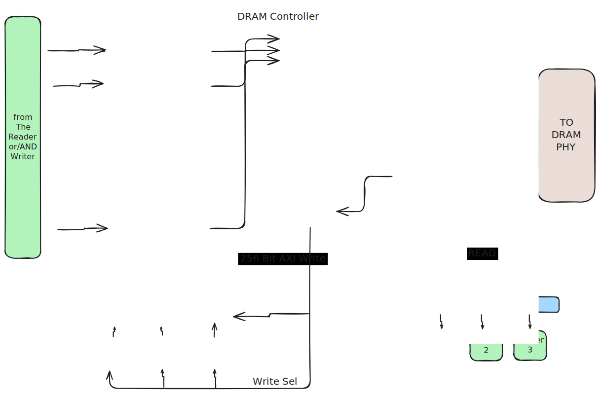

.. _DRAM_controller:

DRAM Controller
*****************

This document presents the architecture of Memory Controller with 'N' requestors
and a 'Round Robin Priority Arbiter'

It comprises of 'N' ports wherein, each requestor is connected to a particular
port based on the priority. Port 0 has highest priority whereas port 'N' has the
least priority. Each port has controller and a queue associated with it, if it
recieves a valid read/write request then it is forwarded to the queue and these
requests are further forwarded to "Round Robin Arbiter". Each request in the
queue stores various fields such as, port-ID, Address, read/write, and
burst-length. Native to AXI interface converts these requests to AXI signals to
be applied to DDR.

**Scheduling Mechanism:**

At the start of every memory scheduling cycle, the queues are scanned and a
request is processed in the order of the highest priority port first then the
lower priority port. The requests that are issued at the ports are dispatched
into queue, and if any queue has a valid request then the arbiter selects that
request and issues a grant. If there are multiple requests from different queues
then grant is issued in round robin fashion. If all the requests are processed
or if queues are empty then priority of port 0 is reset to highest in next
memory cycle.

The request that recieves a grant is further processed by "Request Manager"
which forwards the address, burst-length and other signals to "Native to AXI
interface" module to sent to DDR. Upon recieving the reponse from AXI interface,
another request can be scheduled for the processing.  To monitor the request
that is being acknowledged and/or processed, there exists an "ID Manager" that
issues select/ready/ack signals to the requestors for the data transfer.

If requestor issues a 'read' request then after recieving valid data from DDR,
select signal is issued and then data is transferred to the blocks on 256-bit
`WRITE` channel of the memory controller, whereas for a 'write' request, when it
recieves a WREADY reponse from AXI then it issues an 'ack' signal to accept the
data from the blocks to sent to DDR.

**Round Robin Arbiter:**

A Round Robin Arbiter with Priority is an arbitration scheme that allocates a
shared resource among multiple requestors. Requestors are categorized into
different priority levels based on predetermined criteria. In each memory cycle,
the arbiter follows a round-robin sequence to grant access to requestors.

.. note:: For more details related to AXI interface and the signals, refer to
   AXI specification user guide.
   `<https://developer.arm.com/documentation/ihi0022/e/>`_
