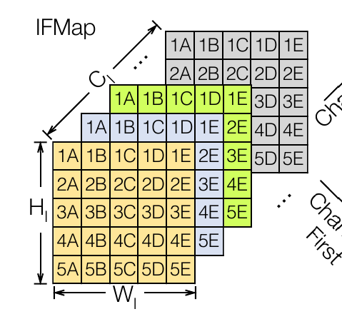
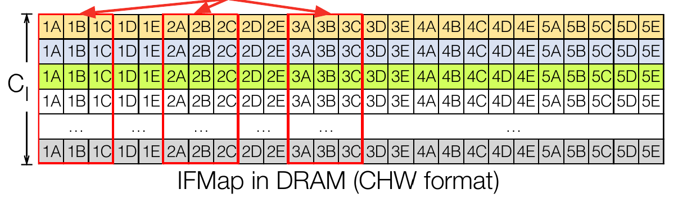
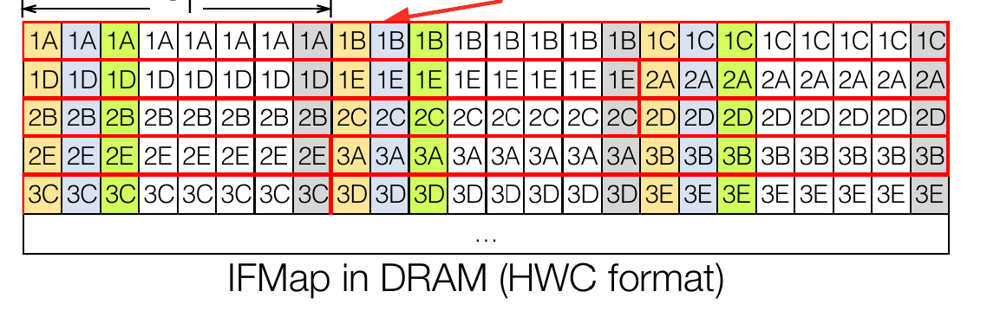

.. _end:

Get to know Gati.
#################

.. sectionauthor:: Yaswanth Tavva (@yswntht)

This is the an incremental document and is subjected to revisions. At
the point of reading this document, do check with @akshar001 if this
continues to be the latest interpretation of Gati architecture.

.. contents:: Table of Contents
   :local:
   :depth: 1

Common Definitions
******************

Row Major Ordering
------------------
Row-major ordering is a linear memory storage
approach where elements of a multidimensional array are stored in
consecutive memory locations row by row. In this arrangement, the first
row’s elements are stored contiguously, followed by the second row, and
so on. For example, in 224x224x3 (image with three channels), all rows of
channel 1 are followed by rows of channels 2 and so on. Consider a three
channel image as shown in the following figure (From :cite:`im2col_zhou2021`):

Row major ordering for this image would look something like this: 

Following is the pattern:

.. code::

  (e1,1-c1),(e1,2-c1),…(e1,224-c1),…(e224,224-c1),
  (e1,1-c2),(e1,2-c2),…(e1,224-c2),…(e224,224-c2),
  (e1,1-c3),(e1,2-c3),…(e1,224-c3),…(e224,224-c3)

Channel First Layout
--------------------
Channel-first layout, often referred to as
“NHWC” (Number of images, Height, Width, Channels), is a data
arrangement format commonly used in deep learning frameworks,
particularly for convolution neural networks (CNNs). In this layout, the
channels (e.g., color channels in an image) are the innermost dimension,
followed by width and height. For example, 224x224x3 (image with three
channels), element1 of all channels are next to each other, till last
element of row of all channels. Likewise for all rows. 

Channel first for the image from the above section is arranged as shown
in the following figure:

Following is the pattern:

.. code::

  (e1,1-c1), (e1,1-c2), (e1,1-c3), … (e1,224-c1), (e1,224-c2),
  (e1,224-c3), (e2,1-c1), (e2,1-c2), (e2,1-c3), ………(e224,224-c1),
  (e224,224-c2), (e224,224-c3).

Systolic Array
---------------
A `systolic array <https://en.wikipedia.org/wiki/Systolic_array>`_ is a parallel
computing architecture that organizes processing units in a regular grid,
resembling a matrix. Data flows through the array in a systolic fashion, where
computations are performed in a pipeline manner. This design enhances throughput
and efficiency, commonly applied in tasks like matrix multiplication and signal
processing in parallel computing systems. In version1, we consider 9x8 arrays of
8 units. Each of 9x8 is referred as an **engine**.

Partial Sums
---------------
A partial sum refers to the accumulated total of a subset of a series or
sequence. It represents the sum of a specific range or portion of elements
within a larger set.

Weight Stationary Data Flow
----------------------------
Weight stationary data flow is a computing paradigm in neural network
accelerators where weights are stored in a stationary manner, allowing parallel
processing of data across multiple computing units. This architecture enhances
efficiency by minimizing data movement during neural network inference,
optimizing for tasks like convolution operations in deep learning.

Systolic Dataflow
-----------------
Systolic dataflow and weight-stationary dataflow are related but distinct
concepts. In systolic dataflow. processing units arranged in a grid perform
computations in a pipeline manner. Data is “pumped” through the array
bidirectionally (top-to-down and left-to-right), and each processing unit
processes a portion of the data as it passes through. In case of weight
stationary, weights are pre-loaded to the systolic array first and during
operation, data is only “pumped” left-to-right. In both cases, partial sums are
moved vertically down and final sum is available at the lower most processing
unit. **In other words**, in weight stationary, inputs are shared, while in
systolic dataflow, both inputs and weights are shared. Chapter 5 of
:cite:`sze2020` contains in-depth explanations of different dataflows.

INT8 quantization
------------------
Integer 8 (INT8) quantization is a data compression technique that represents
numerical values using 8-bit integers. This reduces the precision of the
original data but significantly decreases storage requirements and computational
complexity. *Gati currently assumes that activations and weights are INT8
quantized*. See :ref:`quantization` for more information.

Clipping
--------
If the output surpasses this limit, the function replaces
it with the predefined maximum value. we see this operator in MobileNet.
Thus be sure to revisit in future.

.. seealso::

  `Efficient Processing of Deep Neural Networks - Sze
  <https://link.springer.com/book/10.1007/978-3-031-01766-7>`_

  `Digital Design: Principles and Practices - Wakerly
  <https://www.amazon.com/Digital-Design-Principles-Practices-Book/dp/0131863894>`_

Neural Networks Prerequisites
**************************************

“Thoroughly” read (i.e. spend time reading, studying, digging deep into a text)
book-chapters 1 and 2 from :cite:`sze2020`. So, these are must-read before
moving to next chapters of this document.

VGG16
-----

VGG16 :cite:`simonyan2015deep`, short for Visual Geometry Group 16-layer, is a
convolution neural network (CNN) architecture designed for image classification.
Developed by the Visual Geometry Group at the University of Oxford, VGG16 is
known for its simplicity and effectiveness. It gained prominence as a
participant in the ImageNet Large Scale Visual Recognition Challenge (ILSVRC) in
2014.

The architecture comprises of 16 layers, including 13 **convolution layers** and
3 **fully connected layers**. The convolution layers have small 3x3 filters, and
the network’s depth stems from stacking multiple convolution layers. 2x2
Max-pooling layers are utilized for down-sampling and introducing translation
in-variance. VGG16’s architecture remains consistent in terms of filter size
(3x3 stride 1) and max-pooling spatial resolution (2x2 stride 2) until the fully
connected layers.

Here’s a breakdown of VGG16’s architecture:

1. Input Layer:Accepts input images of size 224x224 pixels with three
   color channels (RGB). Note the only the first layer input is
   mentioned in terms of RGB. As as we go deeper in the network, we
   simply refer as channels. For examples layer two’s input is
   224x224x64. i.e., input has a 64 dimension channel.

2. Convolutional Blocks (Block 1 to Block 5): VGG16 has five convolution
   blocks. Each block comprises one or more convolution layers, followed
   by a max-pooling layer.

   The convolution layers use 3x3 filters, and the number of filters
   increases with the depth of the network. The max-pooling layers have
   2x2 filters and a stride of 2, reducing spatial dimensions.

3. Fully Connected Layers: After the convolution blocks, VGG16 has three
   fully connected layers for high-level feature representation. The
   fully connected layers have 4096 neurons each, leading to a large
   number of parameters.

4. Activation Function: Rectified Linear Unit (ReLU) activation
   functions are applied after each convolution and fully connected
   layer, introducing non-linearity.

5. Softmax Output Layer: The last layer is a softmax output layer with
   1000 neurons, corresponding to the 1000 classes in the ImageNet
   dataset.

VGG16’s architecture (our focus) has inspired subsequent CNN designs,
including deeper variants like VGG19. While VGG16 achieved strong
performance in image classification, it has limitations such as a large
number of parameters, which can lead to overfitting, and computational
demands. Nevertheless, it remains valuable for benchmarking and as a
pre-trained model for transfer learning in various computer vision
applications.

Memory Layout Of DRAM
*********************

.. TODO
   write more about this

When finalizing the memory layout factor in all the values that are to
be stored in the DRAM.

1. configurations
2. biases
3. values of batch normalization (not required for VGG16)
4. input feature maps for N images
5. weights for convolution layers and fully connected layers
6. intermediate channel outputs
7. layer outputs

(shreeyash: add few examples formats for 4,5,6,7. images from your book
also would do.)

for other queries: shreeyash

Configuration Block
*******************

.. sectionauthor:: Shreeyash Pandey (@bojle)

.. TODO
   write more about this

.. csv-table:: Configuration For Convolution Block
  :header: "Conv", "Opcode", "IW", "IH", "OW", "OH", "IC", "KN", "KW", "KH", "Stride", "Padding", "Dram Address", "Total"

  "Bits","4","10","10","10","10","10","10","4","4","3","3","32","110"

.. csv-table:: Configuration For Tail Block
  :header: "TailBlock","Opcode","BNChannels","BNAddress","ReluClip","QuantScale","QuantShift","PoolType","PoolParam", "Width","Height","Stride","Padding","Total"

  "Bits","4","10","10","10","10","10","10","4","4","3","3","32","110"

.. csv-table:: Configuration For Fully Connected Block
  :header: "FC","Opcode","WeightRows","WeightCols","InputRows","DropoutConstant","Address","Total"

  "Bits","4","16","16","16","8","32","92"

Configuration block stores required configurations for each layers and
programs input, output, and tail blocks ahead of time so that they can
immediately switch to new settings after completion of the current layer
and start processing next layer. 

Each table above shows a config packet of 128 bits. Understand these
packets as instructions where the instruction width is 128. None of the
above configs currently take all 128 bits, this is not a problem, these
least significant remaining bits can be assumed to be reserved.

Gati Architecture
*****************

.. sectionauthor:: Shreeyash Pandey (@bojle)

.. TODO:
   add images here

At this point we believe that you have covered sufficient background on
CNNs and various assumptions we made throughout. we thus freely use the
technical keywords without elaborating them in detail.

Gati currently assumes to have 8 units 9x8 weight stationary systolic
array. Each of these units is called a compute engine. A compute engine
is a 2D grid of processing elements arranged in 9 rows and 8 columns.
our choice of 9 rows is because of filter size of VGG16, i.e., 3x3 -
having a compute engine that is coherent in size with filter size
simplifies the dataflow design; however this could be extended to other
filter sizes. each 3x3 filter here can be visualized as a column of 9
elements. Thus all 9 weights of a filter can be exactly fit to compute
engine’s column. in 8 columns of compute engine 8 unique filters can be
pre-loaded. so, in each of 9x8, first 8 filters are loaded, respective
to the engine. After completion of loading weights, each compute engine
is set to accept inputs. 8 engines in-parallel accept first 8 channels.
partial-sums are collected (and added) before passing to the tail
blocks. Tail blocks apply activation functions (e.g. relu), dropout, and
perform operations like downsampling (e.g. maxpooling); in some cases
(transform to row-major format). Finally, the data is staged in FIFOs to
be written back to DRAM.

Input Blocks 
------------

The input block includes the blocks that read from (in most cases) from the DRAM
and bring data to the Systolic array. This includes:

1. Inputs
2. Weights
3. Biases
4. Partial Sums (Accumulants)

Inputs (im2col) 
===============

.. _bounding_squares:

**Bounding Squares Algorithm**
^^^^^^^^^^^^^^^^^^^^^^^^^^^^^^

.. sectionauthor:: Yaswanth Tavva (@yswntht)

When using systolic array to accelerate CNNs, we cannot operate on image
directly. Instead we need to perform a transformation first called image
to column or commonly called im2col.

The bounding squares algorithm is thus:

1. Index to co-ordinate conversion: The first sub-block of im2col where
   the input data will be getting its respective coordinate (i.e. rows
   and column).

2. valid_sqaures_param: Index to coordinate conversion block is followed
   by valid squares block, here if the below nine conditions are
   satisfied valid bits will go high and that gives the number of
   squares in which an element would be part of. The size of the kernel
   is 3*3 so we can expect each patch of the image to have 9
   blocks/coordinates enclosed within it and so the 9 various
   conditions. The square is considered to be a valid one if the filter
   that is covering that patch of the image is within the image boundary
   i.e. 224x224-matrix size.

   -  Check If (x,y) is greater than 1 and if the input co-ordinate is
      bounded between (x,y) and (x+2,y+2). If so valid[0] goes high.
   -  Now from (x,y), go one row above i.e. (x-1,y) and check if input
      co-ordinate is bounded between (x-1,y) and (x+1,y+2). if so
      valid[1] goes high.
   -  Now from (x,y) we go two rows above i.e. (x-2,y) and check if
      input co-ordinate is bounded between (x-2,y) and (x,y+2). if so
      valid[2] goes high.
   -  Then from (x,y) we go one column behind i.e. (x,y-1) and check if
      input co-ordinate is bounded between (x,y-1) and (x+2,y+1). if so
      valid[3] goes high.
   -  Then from (x,y-1) we go one row above i.e. (x-1,y-1) and check if
      input co-ordinate is bounded between (x-1,y-1) and (x+1,y+1). if
      so valid[4] goes high.
   -  Then from (x,y-1) we go two rows above i.e. (x-2,y-1) and check if
      input co-ordinate is bounded between (x-2,y-1) and (x,y+1). if so
      valid[5] goes high.
   -  Now from (x,y) we go two columns behind i.e. (x,y-2) and check if
      input co-ordinate is bounded between (x,y-2) and (x+2,y). if so
      valid[6] goes high.
   -  Then from (x,y-2) we go one row above i.e. (x-1,y-2) and check if
      input co-ordinate is bounded between (x-1,y-2) and (x+1,y). if so
      valid[7] goes high.
   -  Then from (x,y-2) we go two rows above i.e. (x-2,y-2) and check if
      input co-ordinate is bounded between (x-2,y-2) and (x,y). if so
      valid[8] goes high.

3. Valid Rows: The last sub-block of the module, here the nine rows are
   assigned with constant values form 1 to 9 when the patch of the image
   is converted into its corresponding column, it’d yield us 9 rows,
   hence 9 rows are driven. Of these 9 rows few can be valid which is
   given by the valid_sq_o.

Note that incoming data to im2col is in row-major format. Following the
above three steps, data is then staged in input FIFOs of each engine.
Input FIFOs are required to stage the *ready* data temporarily till all
FIFOs have at least one element; only then input FIFOset at each engine
will be issued a read. The data is then pushed into the engine for
convolution operation.

for other queries: chaya, praveen, shreeyash

**Coordgen Algorithm**
^^^^^^^^^^^^^^^^^^^^^^

.. sectionauthor:: Shreeyash Pandey (@bojle)

.. TODO
   reorganize

Refer to :ref:`im2col_coordgen`

Weights
========

.. TODO
   more details

Request weights from DRAM in the available bandwidth of DRAM. weight
FIFOset has 64 FIFOs.On a DRAM read request, the incoming 32 bytes are
evenly distributed amoung first 32 FIFOs, one byte for one FIFO. second
read request is distributed among rest 32 FIFOs.

for other queries: shreeyash

Systolic Array
--------------

**Systolic Array** here is combination of one or many compute engines.
current version of SA assumes a weight stationary Processing element for
convolution layers and output stationary for fully connected layers.
configuration block instructs to switch weight stationary to output
stationary. exploring other dataflows (e.g. row stationary) for
convolution layers is a future work.

For fully connected layers we use only one row of all available rows.
outputs at each column are accumulated to previous value. This can be
visualized as 1-D systolic array where the input are moved horizontally
and each column receives a weight. you may notice from fully connected
layers that a weight is only used once. Thus having 1-D (1-row x
N-columns) systolic array is sufficient; as inputs are reused across
weights, they are passed horizontally, while weights are not used more
than once, they are passed vertically.

for other queries: roshni, shwet, shreeyash.

Output Block
------------

1. opFIFO set1: FIFOs at immediate output of SA.
2. Adder **trees** between compute engines
3. opFIFO set2: FIFOs to stage DRAM reads (these are the partial sums of
   previous layers)
4. adder tree between results of previous adder tree and staged data in
   set2.
5. delay registers
6. crossbar and configuration design.
7. opFIFO set3: FIFOs at the output of the crossbar.

**opFIFO set1**: these FIFOs are present at the output of systolic array
to collect the partial sums from each column of systolic array. thus,
set1 has 64 FIFOs. one FIFO for each column.

**Adder Tree Set1**: the number of adder tree in set1 is equal to number
of columns in each compute engine. adder tree is log N complexity, where
N is number of inputs. stage 1 of each adder tree is capable of
``ceil (compute engines / 2)`` additions. in our case with 8 compute
engines, each adder tree in stage 1 has 4 addition operations. in total
set1 has 56 addition operators.

**opFIFO set2**: these FIFOS stage the accumulations of partial sums
(previous 8 channels) reads from DRAM to be added with accumulations of
current 8 channels. opFIFO set2 has 32 FIFOs to accommodate DRAM read.

**Adder Tree Set2**: is responsible for add **opFIFO set2** data with
results from **adder tree set1** before forwarding to the delay
registers block. size of adder tree set2 is similar to adder tree set1.
adder tree set2 accepts input from opFIFO set2 (8 elements at a time)
and output of adder tree set1 (also 8 elements).

**Delay Registers Block**: these registers align incoming data so that
crossbar enables transformation of data into row-major format required
for next layer. thus is only enabled after adder tree set2 after
accumulating all the channels. Moreover, implementation need not be dead
on as described. You may realize very soon that it is not practical to
add many registers because adding many registers physically is not a
scalable solution. *An alternative approach is to use counters to create
the delay without the registers*.

+--------+--------+--------+--------+--------+--------+--------+--------+
| S      | S      | S      | S      | S      | S      | S      | S      |
| A-col1 | A-col2 | A-col3 | A-col4 | A-col5 | A-col6 | A-col7 | A-col8 |
+========+========+========+========+========+========+========+========+
| -      | -      | -      | -      | -      | -      | reg    | reg    |
+--------+--------+--------+--------+--------+--------+--------+--------+
| -      | -      | -      | -      | reg    | reg    | reg    | reg    |
+--------+--------+--------+--------+--------+--------+--------+--------+
| -      | -      | reg    | reg    | reg    | reg    | reg    | reg    |
+--------+--------+--------+--------+--------+--------+--------+--------+
| reg    | reg    | reg    | reg    | reg    | reg    | reg    | reg    |
+--------+--------+--------+--------+--------+--------+--------+--------+
| x      | x      | x      | x      | x      | x      | x      | x      |
| bar-I1 | bar-I2 | bar-I3 | bar-I4 | bar-I5 | bar-I6 | bar-I7 | bar-I8 |
+--------+--------+--------+--------+--------+--------+--------+--------+

.. note::
    
  `reg` here is an 8 bit register.

**Crossbar And Configuration Design**: Each NN layer expects data to be
in row-major format. But the way that systolic array operates cripples
the data format. To arrange back to row-major order, we use Delay
Registers and crossbar pair. (first Delay Registers, followed by
crossbar).

crossbar is N input and N output switch. Depending on the configuration
there is one-to-one mapping of input to output ports. using the
**crossbar alone** will not provide row-major formatting. However, with
a sequence of correct configuration settings to crossbar and Delay
Registers, we can achieve the required format that next layer expects.
So configurations are to be such that when a read is issued on this (in
future), first 4 bytes of 32 bytes DRAM read should consist of engine 1
data; byte 5 to byte 8 should have engine 2 data and likewise bytes for
other engines are available in above manner. This data rearrangement is
enabled by crossbar and Delay Registers.

.. note::

  PS: Our current version with 9x8 x8 assumes that all im2cols are
  synchronously feed from the incoming DRAM data. For a DRAM read (32
  bytes), each compute engine is delivered with 4 bytes. To accommodate 4
  byte at each engine, it is also assumed that few registers (e.g. 256bit)
  are available. you may notice that the number registers available limits
  the burst-read length.

**opFIFO set3**: is available at the of crossbar to collect and stage
the output before issuing a write to DRAM. note that due to delay
registers it takes 7 cycles to collect 32 bytes of data, 11 cycles to
collect 64 bytes of data. so only after 7 cycles (11 cycles) a DRAM
write (burst 2) can be issued.

for other queries: shreeyash

Timeline and burst analysis
---------------------------

Number of buffer registers available at each compute engine decides the
dram bandwidth. With 16 buffers (128 registers) at each engine we have
16 cycles. With 32 buffers we have 32 cycles dram available. however,
these available cycles (16 or 32) has to be smartly distributed between
blocks that access the dram. Our current version considers a
**fixed-weighted** distribution on DRAM allotment to each of the above
blocks that accesses the DRAM. However, in future revisions this could
be extended to **on-demand-dynamic** allotment of DRAM access to these
blocks.

1. In the current version, with 16 buffer variant, for every 16 cycles:
   im2col block accesses 4 cycle burst, an equal number of cycles to
   dram read by opFIFO set2 - 4 cycle burst, 2 cycle burst write of
   opFIFO set3 to DRAM. Left 6 cycles can be allocated to weight block
   or other block that requires DRAM access.

2. In the current version, with 32 buffer variant, for every 32 cycles:
   im2col block accesses 8 cycle burst, an equal number of cycles to
   dram read by opFIFO set2 - 8 cycle burst, 4 cycle burst write of
   opFIFO set3 to DRAM. Left 12 cycles can be allocated to weight block
   or other block (mipi) that requires DRAM access.

for other queries: shreeyash

Performance
-----------

Our latest performance estimates of imagenet on VGG16 achieve approx
300ms/frame for 9x8 x8 considering 100 MHz. 260ms is spent on first 13
convolution layers and 30ms of rest 40ms is spent on first fully
connected layer with 100MB of weights. our baseline jetson nano 2GB
achieves 130ms operating at 900 MHz.

for other queries: shreeyash

Tail Blocks
-----------

.. TODO:
   These sections

1. ReLU

2. Quantization

3. Dropout

4. Maxpooling: you may notice that maxpooling in VGG16 is with 2x2
   kernel and stride 2. Consider a 224x224 matrix. First maxpooling is
   operated on elements 1,2,225,226 - these are first two-elements of
   rows 1 and 2. Second maxpool is on elements 3,4,227,228. however,
   partial sum that are generated which eventually feed to maxpool are
   in row-major order. thus 225,226 will not be present in immediate
   next cycles of elements 1,2. This is a problem. so our first goal is
   to solve maxpooling operation for incoming elements in row-major and
   at the same time we should preserve pipelineing that enables high
   throughput. To achieve this, maxpooling is done in three steps:

   -  Phase1 comparison. compares two elements at a time and outputs the
      greater element. e.g. cycle1 compares elements 1 and 2. cycle 2
      compares elements 3 and 4. *be sure not to compare elements 2 and
      3 in cycle 2*.
   -  FIFO1 to stage results from phase1. back to our example matrix,
      224x224. In row1, we have 112 comparisons. so, the FIFO stores 112
      values. so head of the FIFO points to greater value in elements 1
      and 2. second FIFO index points to greater value in elements 3 and
      4 and likewise till elements 223, 224.
   -  We then start row2. Here perform phase1 comparison. But now we do
      not push the result to FIFO instead push to phase2 comparison.
   -  phase2 comparison. compares two elements at a time and outputs the
      greater element. operand one is element that is read from FIFO1
      and operand two is result from phase1 comparision. the final
      result of maxpooling operation is obtained after phase2. you may
      visualize that odd rows are first pushed to FIFO while the even
      rows are directly forwarded to phase2 comparison.

   All the above three steps constitute hardware for maxpooling block.
   **total maxpooling blocks is equal to number of columns in one
   compute engine**.

5. Batch Normalization

Bus
---

This block is work in progress and is lead by Praveen. Details will be
updated as they are available.

Typically, a bus is a medium of communication between different hardware
blocks. The block that initiates a request is called *master*, and
*slave* responds. E.g. a compute engine that processes the data does one
read request to memory to bring the inputs and one write request to
writeback the processed data. memory here is the slave.

for other queries: praveen

End to end flow for a given layer 
---------------------------------

.. note::

  This flow abstracts microarchitecture details

T1 - Default State
==================

What is the default state?

The system is in its default state when it is idle and only the DRAM has
been initialized. i.e., DRAM contains the input images, weights, and
configurations required for input/ output, and tail blocks. The weight
and im2col FIFOs are both empty.

T2 Start im2col Block
=====================

Our im2col profile analysis revealed that it has a ~450 cycle cold start
time. So, this takes precedence over the weight block. However, this is
a one-time occurrence and is not a recurring tendency. Requests for
im2col and weights blocks are handled on a first-come, first-served
basis at a later stage. The idea is to understand the execution pattern
so that we can postpone few requests to a later point in time as all
requesting-blocks (e.g. im2col and weight blocks) might not need the
data right away.

.. note::

  1. The cycle difference between the first im2col column
  entering row FIFO and the cycle when the first column from FIFOs is
  pushed into SA is referred to as the “cold start time” in this context.
  We must acknowledge that the data is biased because of im2col’s design.
  Therefore, it takes 450 cycles for us to reach the point where every row
  is available, each containing at least one element, and is therefore
  prepared for pushing into the SA.
  
  2. See :ref:`bounding_squares` im2col architecture for more understanding on this 450 cycle latency.

T3 Start Weight Block
=====================

We handle requests from the weight block after the memory controller
responds to an im2col request. A burst read request can be sent at first
by weight blocks. DRAM can write up to (512x32 bytes of data) in this
scenario. The process is atomic for the first 288 bytes of data. (SA is
responsible for this. The first step is to pre-load the weights into
specific weight buffers in the SA PE. This corresponds to 288 bytes in a
9x32 SA grid.) It may be interrupted for later bytes if there are more
requests to handle by memory controller. At this point, weight block can
accept any external commands to push data to SA once 288 elements are
available.

T4 Message Passing Between Im2col And Weight Blocks
===================================================

Before delving into the explanation of message passing, it is important
to keep in mind that while all other blocks can initiate data requests,
only the dram block can initiate configuration requests. Message passing
between weight block and im2col makes sure that pushing input and
flashing SA (loading weights): (1) Properly pushed into SA to prevent
premature flashing and contaminating the current weights. (2) Before
adding the next channel or switching to a new layer, a given input
channel must only be iterated a set number of times. (The terms
“channels” here refer to the three original RGB channels or the layer N
output’s k channels, which serve as layer N+1’s input.)

The main questions we address here are: (1) How long must weights be
stationed in SA, or, alternatively, when should we flash SA with new
weights? (2) The number of iterations a channel must undergo on SA
before switching to a new channel is limited.

1. The number of times a channel needs to load? Every time SA is
   flashed.
2. How many flashes of SA are necessary? -> (a) Is dependent on the size
   of the SA column. (b) is dependent upon #unique kernels. For example,
   layer 1 in VGG16 contains 64 distinct kernels, whereas the column
   size in our SA is 32. Thus, ``(#kernels / SA col size)`` is the
   formula for the number of times SA needs to be flashed. In this case,
   64/32 = 2.
3. When must SA be flashed? -> after the final column of the expanded
   matrix that is pushed into SA, or at the end of im2col. Here, a
   counter is required to keep track of this. The expanded matrix for a
   224x224 input matrix has columns equal to 50176 columns, which is the
   same as 224 multiple times 224.
4. When does one need to load a new channel? Following the push of #SA
   flash times by the current channels.

This is one possible approach with decentralized control. Nevertheless,
we leave this to implementation on how to manage the im2col block,
weight block and incoming configurations from configuration block. Other
approach is to have a centralized control that decodes the configuration
and manages weight and im2col blocks.

T5 Accumulating the output partial sums.
========================================

For each SA flash, we iterate a channel once in our current data flow.
The output FIFO has the partial sums and convolution outputs, which are
then sent to DRAM. The partial sums of kernel<1> on all channels must be
added together in accordance with the NN algorithm. However, according
to our algorithm, these partial sums of other channels are neither
immediately accessible nor can previous channels be stored and
accumulated using on-FPGA BRAM due to their large sizes. We therefore
came up with this plan to control the accumulation of output partial
sums.

To do this: First, the DRAM controller receives the output partial sums
from SA, which are then written into DRAM. Second, the previous
channel’s output is read from DRAM and is currently awaiting the
addition of the subsequent channel’s partial sums. Third, a vector
addition unit (an adder tree) receives both incoming and just-from-DRAM
psums for the purpose of adding. Fourth, the total is written back. This
is a pipelined and iterative process. All of the accumulation has
already been completed by the time the final partial sums from SA
arrive. Final accumulation happens shortly after the DRAM controller
receives the output psum of the final channel from SA. These psum
deposits can now be used as input to the next layer.
