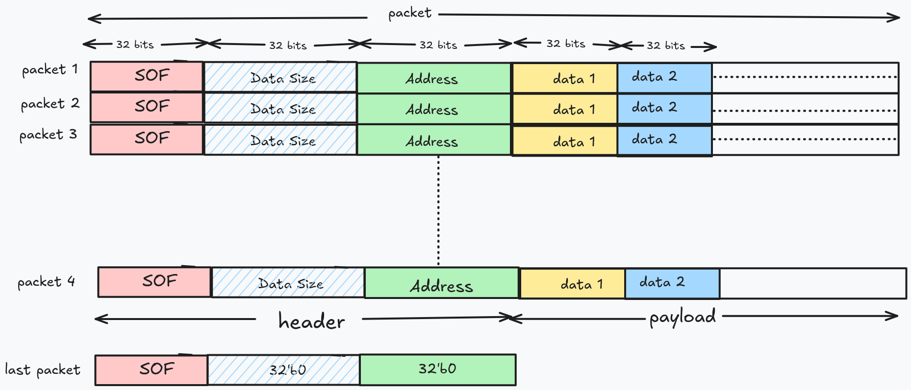

Gati
####

.. toctree::
    :hidden:

    input_blocks
    sa
    quantization
    dram
    configuration-block
    DRAM-controller
    adder_tree
    mega_pool
    reshape_transpose
    Sigmoid
    Resize
    eltwise_op
    DWP
    dispatcher
    nms
    concat
.. contents:: Table of Contents
   :local:
   :depth: 1

Here's a Bird's eye view picture of the entire CNN architecture:

.. image:: _static/Overview.png
   :width: 100%
   :align: center

Following sections describe what each block in the image above does.

ONNX
****

:term:`ONNX` involves reading the model file on the CPU, transforming (eg, from
:term:`Row Major Order (NCHW)` to :term:`Channel First Layout (NHWC)`),
optimizing (eg, operator fusion), reading images from the user and trasmitting
it to the FPGA. This process happens exclusively on the CPU (:term:`RK3399`).

CPU <-> FPGA
************

Vaaman has the arrangement:

.. image:: _static/vaaman-arch.svg
   :width: 80%
   :align: center

Communication b/w the CPU and FPGA are carried out by the `Rah
<https://github.com/bojle/macacetamol>`_ library. Rah abstracts the underlying
:term:`MIPI` interface. 

Input Blocks
************

The input block includes the blocks that read (in most cases) from the DRAM
and bring data to the Systolic array. This includes:

1. Inputs
2. Weights
3. Biases
4. Partial Sums (Accumulants)

Please see :ref:`input_blocks` for more information.

Systolic Array
**************

Gati currently assumes to have 8 units 9x8 weight stationary systolic
array. Each of these units is called a compute engine. A compute engine
is a 2D grid of processing elements arranged in 9 rows and 8 columns.
our choice of 9 rows is because of filter size of VGG16, i.e., 3x3 -
having a compute engine that is coherent in size with filter size
simplifies the dataflow design; however this could be extended to other
filter sizes. each 3x3 filter here can be visualized as a column of 9
elements. Thus all 9 weights of a filter can be exactly fit to compute
engine’s column. in 8 columns of compute engine 8 unique filters can be
pre-loaded. so, in each of 9x8, first 8 filters are loaded, respective
to the engine. After completion of loading weights, each compute engine
is set to accept inputs. 8 engines in-parallel accept first 8 channels.
partial-sums are collected (and added) before passing to the tail
blocks. Tail blocks apply activation functions (e.g. relu), dropout, and
perform operations like downsampling (e.g. maxpooling); in some cases
(transform to row-major format). Finally, the data is staged in FIFOs to
be written back to DRAM.

Systolic Array here is combination of one or many compute engines.
current version of SA assumes a weight stationary Processing element for
convolution layers and output stationary for fully connected layers.
configuration block instructs to switch weight stationary to output
stationary. exploring other dataflows (e.g. row stationary) for
convolution layers is a future work.

Refer to :ref:`sa` for more info.

Adder Tree
==========

Refer to :ref:`adder_tree`

Output Block
************

.. TODO
   a good diagram here would be very nice

TODO

Tail Blocks
***********

.. TODO:
   These sections

BatchNorm
=========

:term:`BatchNorm` is a weighted (4 different weights: mean, var, alpha and beta) block just like
the Bias block except the weights are tensors equal in dimension to the previous
layer. Batchnorm requires a multiplication and a division of input (x) with
constants.  This type of operation can usually be fused into previous
convolution layers thus reducing the need for a hard-implementation. For eg, an
Ofmap of size (96,7,7) would need a batchnorm of dimension (96, 4).

ReLU
====

:term:`Relu` is a simple piecewise activation function.

.. image:: _static/Activation.png
   :width: 50%
   :align: center

ReLU is implemented as a pipelined block within the hardware accelerator. It
processes the output of the convolution operation directly in the pipeline,
eliminating the need to write convolution outputs to DRAM and read them back for
ReLU computation. This approach minimizes time penalties associated with memory
access, ensuring higher efficiency and faster data processing.

Bias
====

Bias is scalar addition operation of a constant with incoming value. 

.. image:: _static/Bias_Addition_1.png
   :width: 40%
   :align: center

The bias addition is implemented as a pipelined operation within the hardware
accelerator. The bias values, fetched from DRAM by a dedicated bias controller,
are added directly to the convolution outputs in the pipeline, ensuring
efficient and seamless data processing without additional memory access
overhead.

Element Wise Operations
***********************

The element_wise_op block includes multiple operations that can be done on individual inputs. 
The current supported element wise operations include:

1. Addition 
2. Subtraction
3. multiplication 
4. Sigmoid/Tanh (Refer to :ref:`Sigmoid` for more info.)

For more info on Element wise operation megablock, refer :ref:`eltwise_op`

Resize Operator
**************

Refer :ref:`Resize`.

Quantization
============

.. image:: _static/Quantization1.png
   :width: 70%
   :align: center

:term:`Quantization` is needed because partial sums from the SA are the result
of MAC of multiple 8-bit elements which results in a number that does not
fit in 8 bits. This block makes a PS of larger bit-width fit in 8 bits. 

Refer to :ref:`quantization` for more info.

Pooling Network
***************

Pool Movement
=============

:term:`Pooling` can be understood as two tasks: movement and action.
The movement has parameters: window size, stride and padding that dictate how
big the kernel is and how it should be moved across the Ifmap. Action is
what has to be done to the values in the kernel. Commonly found actions
are Max and Average which gives the name of two popular pool layers: maxpool and
average pool.

Following image shows the pooling network:

.. image:: _static/Generalized_Pool.png
   :width: 30%
   :align: center

The action block can be replaced by any action while leaving the movement
(everything other than action) untouched. 

Assume a pool of window size (KW, KH), stride (S) and padding (P). Movement works thusly:

1. Input I (a scalar value) arrives out from the output fifo 2 into the action
   block.

2. The action block (discussed later) emits another scale value (after some
   cycles) and stores into F1.

3. Once an entire row has been processed, F1 should be filled with some elements
   and F2 should be empty.

4. For second and all subsequent rows (till KH), values from action are sent
   to F2

5. Once a value enters F2, one value from both fifos F1 and F2 (in the diagram,
   the values a1 and b1) are sent to the second action block which runs the
   action on it.

6. Value from this action block is written back into F1 if the current row is
   not the last row, else it is sent out from the pooling network.

Pool Actions
============

Max
---

The max operation takes max b/w two values at a time and stores it 
in a register to use the same value for next comparison. Initially,
the value of reg would be 0. This operation is carried out KW times,
then the value of reg is emitted out of the Max (action) block.

Average
-------

Average b/w N elements requires division by N (a variable) which is not very
convenient on the FPGA. Average of a N element array can be cheaply calculated
by calculating average of 2 values at a time then averaging these averages. This
results in a tree like structure (as represented in lower right corner of the
image). Moreover, division by 2 is simply a right shift by 1.

.. TODO
   add running_averag script to vaaman-vgg-benchmarks

Consider a window size of 6. We need to take 4 averages to calculate an average
of 6 elements. Average block works thusly:

1. Avg of i1 and i2 is calculated (a1) and push to a fifo. In subsequent
   cycles, average of i3 and i4 is calculated (a2) and also pushed to the fifo. 

2. If the fifo has 2 values, average b/w the two is taken and pushed in the
   fifo. 

3. This is done till there is only one value left in the fifo. This is the
   average.

For a odd-numbered window size, say 5, nothing changes except we only have to
take one less average. The extra element is pushed as is in the fifo.

Right shift by 2 of a integer divides it but gets rid of the decimal part (.5)
which may cause a loss in precision. Empirical evaluation shows that the loss
occured is 0.5 to 1.0% of the original which should be acceptable.

Transpose
*********

See: :ref:`reshape_transpose`

DRAM
****

.. TODO
   add an image depicting the complete layout of memory

In the current setting Vaaman's FPGA (:term:`Trion120`) has a discrete DRAM
attached to it. This is not shared with the CPU (:term:`RK3399`). DRAM is used
to store different types of data in different layouts. These include:

1. Inputs (images)
2. Outputs (what becomes the inputs to next layers)
3. Weights
4. Accumulants (partial sums b/w iterations that are not yet outputs)

The architecture substantially affects the layout of the DRAM. So, one layout
would not work for every model. Weights are read-only i.e. once written in the
DRAM at the beginning of the computation, they are only read by the FPGA, never
written to. Therefore weight data can be transposed in expected order by the
CPU, and sent to the FPGA. Inputs/Outputs are read/write, therefore
transpositions on them happens once, at the start, on CPU and later by the FPGA.

For concrete details on the layout and access pattern, see :ref:`ddr_layout_and_access`.

For implementation of memory controller, see :ref:`DRAM_controller`

Configuration Block/Bus master controller
*****************************************

Configuration block stores required configurations for each layers and
programs input, output, and tail blocks ahead of time so that they can
immediately switch to new settings after completion of the current layer
and start processing next layer. 

Each table above shows a config packet of 256 bits. Understand these
packets as instructions where the instruction width is 256. None of the
above configs currently take all 256 bits, this is not a problem, these
least significant remaining bits can be assumed to be reserved.

The Bus Master Controller facilitates communication between a master 
device and multiple slave devices within a system. It transmits the 
instruction set from the config block to different compute block.

For implementation details of config block/Bus master controller, see
:ref:`configuration_block`
or implementation of memory controller, see :ref:`DRAM_controller`

.. include:: instructions/inst.rst

.. _flattening:

Flattening
**********

In a network, when the inputs to FC are the outputs of a convolution operation,
a "flattening" operation needs to be performed on the outputs. Reason is the
order in which the SA that carries out convolution outputs to the DRAM. If, for 
example, a 9x4x4 SA is used, the outputs a NHW4C4, i.e. first four elements of 
channel one, first four elements of channel two, and so on till channel four after
which next four elements of channel one and this continues. FC expects inputs
in the form of 1xN where N is all the elements in row-major order. To deal with
this, when reading NHW4C4 outputs of a convolution, the flattening controller
is used to flatten it to a 1xN so that it can be input to FC. Note that the
flatten controller need not be always enabled, as any FC layers following an FC
layer will have their inputs already flattened. When and when not to enable
flattening is conveniently provided by the software through the 'Flatten' field
in the FC instruction.

Following image shows the flattening process:

.. image:: _static/Flattening.png
   :width: 60%
   :align: center

FC inputs obtained from DDR are storred in local on-chip memory (BRAM). Here 'M'
represents the number of columns in each systolic arrays and 'N' represents the
number of systolic engine.

The flattening controller works thusly:

Each bank is supposed to house a single channel. The NHW4C4 outputs are read,
and split into sections of 4 each. These 4 values are then put into their
respective banks. Then the banks are read out, one after another in serial
fashion which flattens them. 

FC Engine
*********

The FC engine very similar to the SA except for one small difference is the 
dataflow. It is a grid very much like the SA but it works in 'output stationary'
manner i.e. what is being 'stored' inside the PEs is not weights (like Conv
SA) but outputs. Both 'weights' and 'inputs' are continuosly fed to the PE grid.

PE Grid
=======

The inputs to the FC engine would be of the form:

.. code::

   1xN NxM

The output would be of dim:

.. code::

   1xM

`1xN` is the inputs and `NxM` is the weight. 

Based on this the shape of the PE grid can be figured out. 

Since, input is 1 dimensional, we only need one row in the grid. So, the
size should be `1xP`. 

What should `P` be? The DRAM can return a finite number of bytes (elements) (32
bytes for vaaman) in a cycle, so `P` cannot exceed the DRAM bandwidth. The
minimum can be decided based on resource constraints. A good configuration
(which is being used in Gati as of v0.2.4) is 1x32. 

How FC Engine Functions
=======================

.. figure:: _static/FC_Engine.png
   :width: 80%
   :align: center

   *FC Engine - High-Level Architecture*

The weight matrix (`NxM`) is continuosly sent from the weight fifos (that the FC
engine shares with the SA). The inputs are fully stored on-chip in the input
fifos and also sent continuosly. The FC engine processes `P` columns of the
weight matrix at a time. This means that an FC operations takes ~ `Nx(M/P)`
cycles to complete. The weights are arranged and aligned in the order of `P`.
If `M` is not evenly divisible by `P`, extra columns of only zeros are padded
to the weight matrix by the compiler. The outputs are accumulated in the 
accumulator registers. At the end of each iteration, these outputs are sent to
the tail block to be processed further and ultimately end up in the DRAM via
the output block. The process starting from tail block is the same as that of 
conv outputs after vector addition.

Decoding the FC instruction
===========================

The instruction consists of the usual opcodes, input start/end address, weight 
start/end address, and sizes for inputs/weights. 

Explanation of less-standard fields follows:

#. **Flatten**
    If the preceding layer of this FC is a convolution, its outputs (present in
    NHW4C4 order in DRAM) need to be re-arranged in row-major-FC-engine-friendly
    order. This bit signals the config block to enable the :ref:`flattening`
    controller.

#. **ImageDim**
    If flatten is enabled this field is the product of ROW and COLUMN field of
    the previous convolution operation.

#. **Vec2MatCols**
    The input to FC is a vector of size 1xM, the flattening controllers has
    `P` fifos. Vec2MatCols gives the number of elements belonging in each
    fifo aligned to word size.

    .. code::

       vec2matcols = align(M/P, WORD_SIZE)

    For an input tensor, which is the output of a convolution of size
    12x43x43 (CHW), the alignment would be thusly:

    .. code::

      vec2matcols = align(align(43*43, WORD_SIZE) * align(12, WORD_SIZE), WORD_SIZE)

DRAM write protocol
*******************

Storing data on the DRAM needs two main things: data and address. In Gati,
the instruction blob (i.e. set of all instructions), and all the weights (and
biases)
are first stored in the DRAM. Consider a neural net with 5 layers, each layer
having a weight and a bias. In this case, there are total 10 (weight + bias) + 1
(instructions) distinct pieces of data. The software is responsible for figuring
out where each distinct piece of data should be stored i.e. the addresses. Where
to store these distinct packets is communicated to the FPGA through a protocol
called DWP (DRAM Write Protocol). 

Here's the protocol: 

It's a simple packet-based protocol with these fields: SOP (Start Of Packet), DS
(Data Size), and DRAM Address, followed by variable length data (payload). SOP
differentiates two packets.  DS is the size (in bytes) of the following payload.
Address is where the payload should be written in the DRAM. The DWP decoder on
the FPGA interprets these packets and write the data into DRAM. DWP is a 32bit
protocol as the DRAM operates on boundries of 32. All addresses are aligned to
this constraint by the software. 

.. TODO: memory segmentation diagram

For implementation of DWP, see :ref:`DWP`

Dispatch Block 
**************

Once compute is complete, the results need to be sent back to the CPU. 
The Dispatcher takes care of that. All megablocks have a output instruction
sent along with it. This is because all outputs are centrally managed by the
output block. The instruction is really meant for the output block. It contains,
among addresses and sizes, a flag to indicate whether computed outputs need to
be sent to the CPU. This is the `dispatch` flag. If an output instruction
has this enabled, the outputs shall be dispatched back to the CPU. The software
provides a way to enabled dispatch on any megablock layers of the model during
compilation. See user manual of software for more details. 

As a result, the dispatcher is flexible in that it can provide the final results 
after computation has ended, or be used for debugging intermidiate layers.

For more Abstract view of Dispatcher, see :ref:`dispatcher`

NMS
***

For more info see :ref:`nms`

CONCAT
******

For info on cancat see :ref:`concat`
