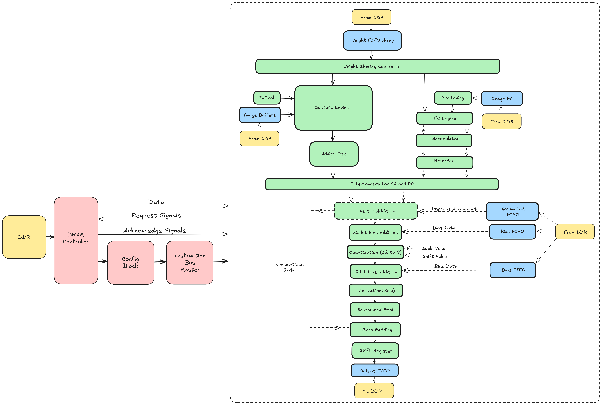
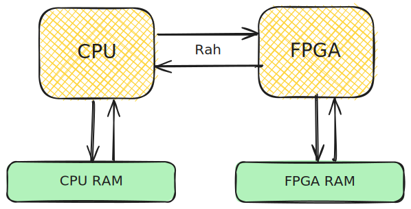
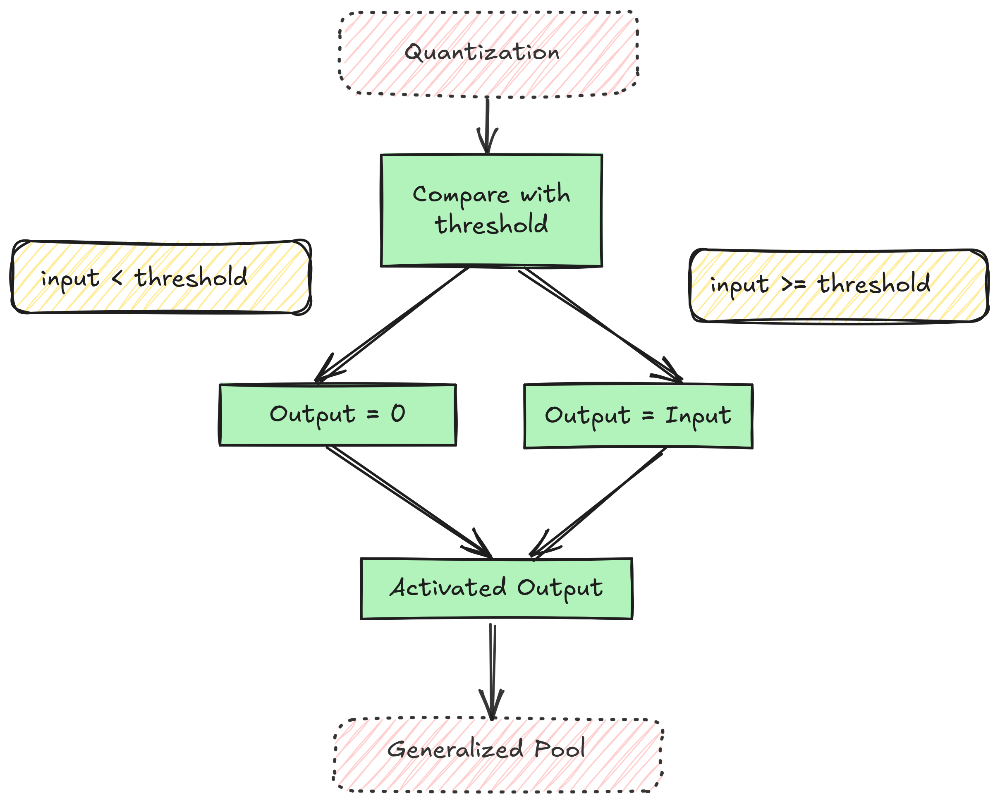
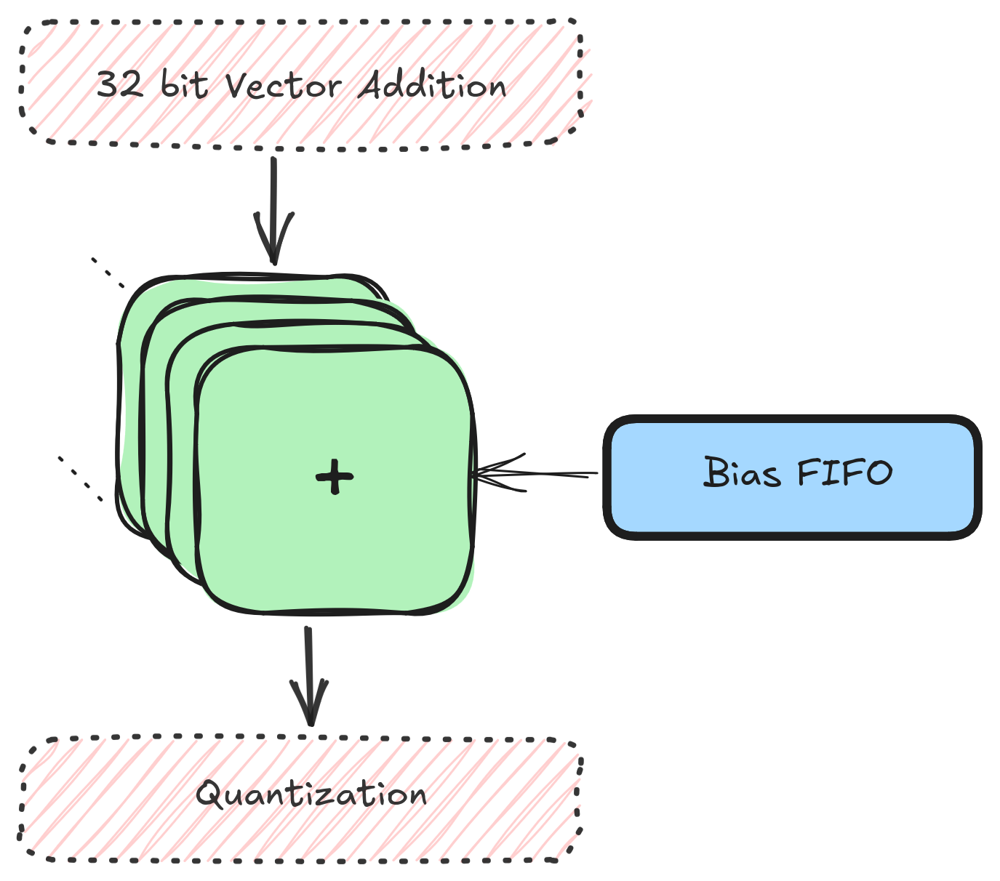
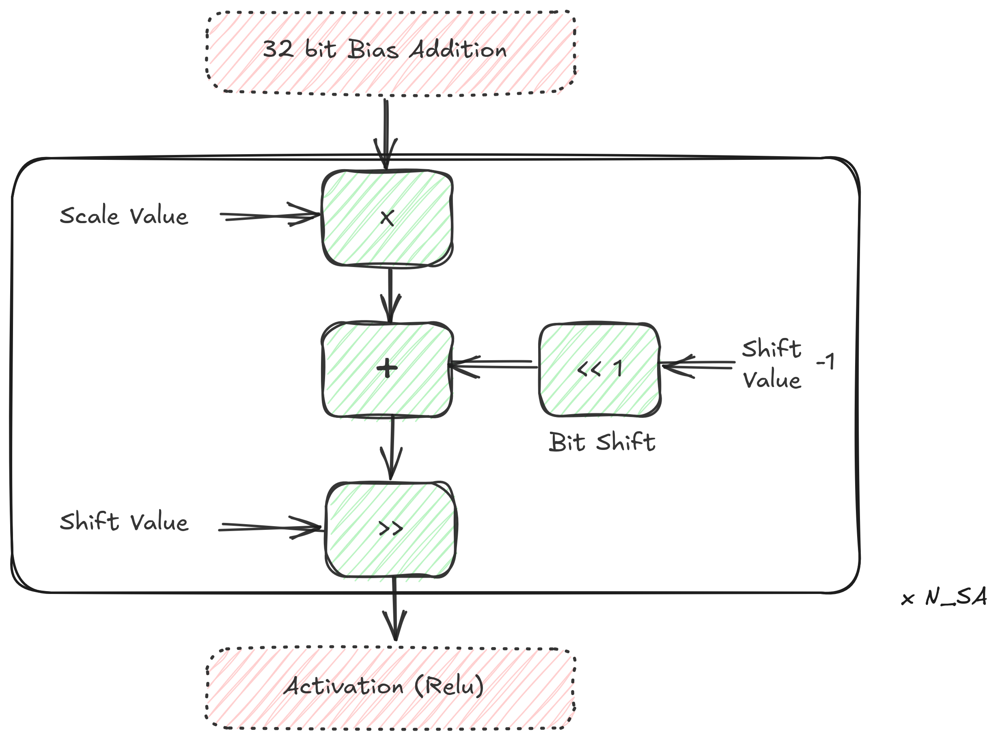
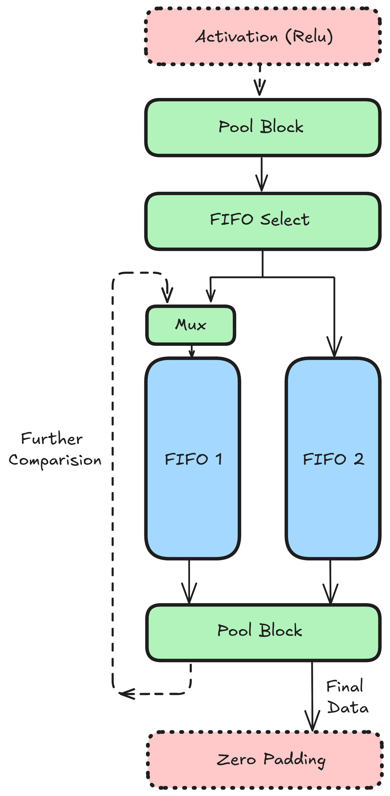
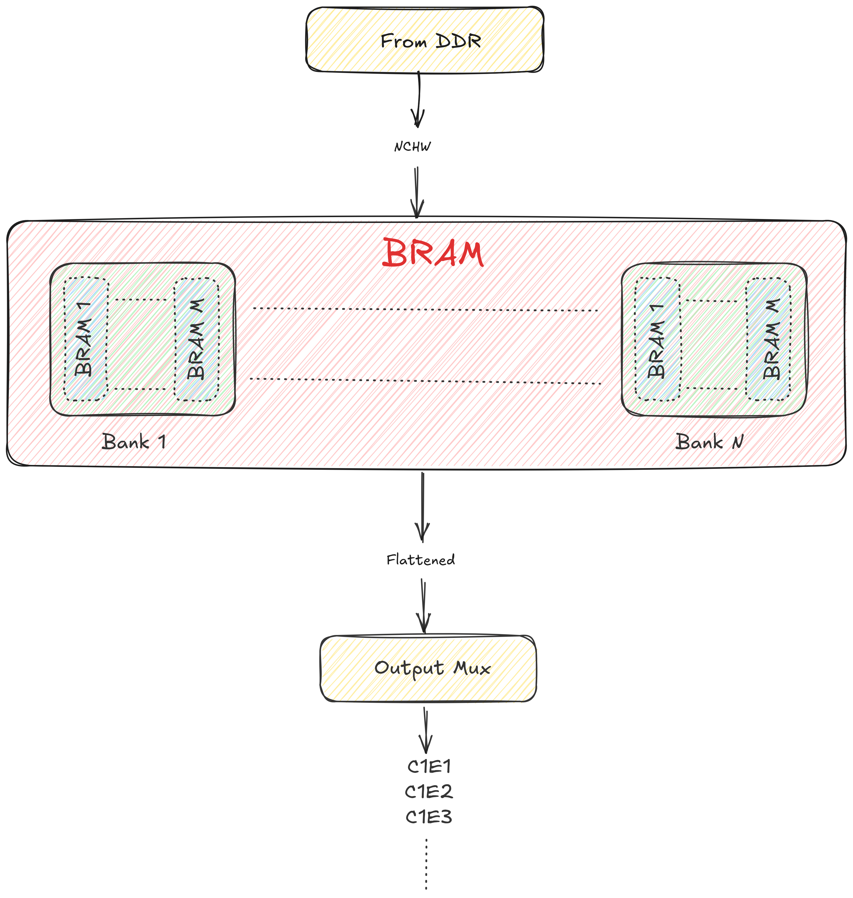
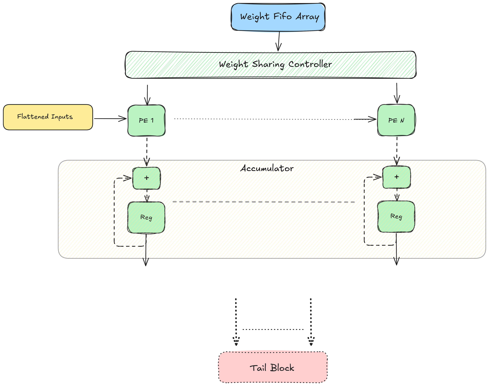

Gati
####

.. toctree::
    :hidden:

    input_blocks
    sa
    quantization
    dram
    configuration-block
    DRAM-controller
    adder_tree
    transpose

.. contents:: Table of Contents
   :local:
   :depth: 1

Here's a Bird's eye view picture of the entire CNN architecture:

Following sections describe what each block in the image above does.

ONNX
****

:term:`ONNX` involves reading the model file on the CPU, transforming (eg, from
:term:`Row Major Order (NCHW)` to :term:`Channel First Layout (NHWC)`),
optimizing (eg, operator fusion), reading images from the user and trasmitting
it to the FPGA. This process happens exclusively on the CPU (:term:`RK3399`).

CPU <-> FPGA
************

Vaaman has the arrangement:

Communication b/w the CPU and FPGA are carried out by the `Rah
<https://github.com/bojle/macacetamol>`_ library. Rah abstracts the underlying
:term:`MIPI` interface. 

Input Blocks
************

The input block includes the blocks that read (in most cases) from the DRAM
and bring data to the Systolic array. This includes:

1. Inputs
2. Weights
3. Biases
4. Partial Sums (Accumulants)

Please see :ref:`input_blocks` for more information.

Systolic Array
**************

Gati currently assumes to have 8 units 9x8 weight stationary systolic
array. Each of these units is called a compute engine. A compute engine
is a 2D grid of processing elements arranged in 9 rows and 8 columns.
our choice of 9 rows is because of filter size of VGG16, i.e., 3x3 -
having a compute engine that is coherent in size with filter size
simplifies the dataflow design; however this could be extended to other
filter sizes. each 3x3 filter here can be visualized as a column of 9
elements. Thus all 9 weights of a filter can be exactly fit to compute
engine’s column. in 8 columns of compute engine 8 unique filters can be
pre-loaded. so, in each of 9x8, first 8 filters are loaded, respective
to the engine. After completion of loading weights, each compute engine
is set to accept inputs. 8 engines in-parallel accept first 8 channels.
partial-sums are collected (and added) before passing to the tail
blocks. Tail blocks apply activation functions (e.g. relu), dropout, and
perform operations like downsampling (e.g. maxpooling); in some cases
(transform to row-major format). Finally, the data is staged in FIFOs to
be written back to DRAM.

Systolic Array here is combination of one or many compute engines.
current version of SA assumes a weight stationary Processing element for
convolution layers and output stationary for fully connected layers.
configuration block instructs to switch weight stationary to output
stationary. exploring other dataflows (e.g. row stationary) for
convolution layers is a future work.

Refer to :ref:`sa` for more info.

Adder Tree
==========

Refer to :ref:`adder_tree`

Output Block
************

.. TODO
   a good diagram here would be very nice

TODO

Tail Blocks
***********

.. TODO:
   These sections

BatchNorm
=========

:term:`BatchNorm` is a weighted (4 different weights: mean, var, alpha and beta) block just like
the Bias block except the weights are tensors equal in dimension to the previous
layer. Batchnorm requires a multiplication and a division of input (x) with
constants.  This type of operation can usually be fused into previous
convolution layers thus reducing the need for a hard-implementation. For eg, an
Ofmap of size (96,7,7) would need a batchnorm of dimension (96, 4).

ReLU
====

:term:`Relu` is a simple piecewise activation function.

ReLU is implemented as a pipelined block within the hardware accelerator. It
processes the output of the convolution operation directly in the pipeline,
eliminating the need to write convolution outputs to DRAM and read them back for
ReLU computation. This approach minimizes time penalties associated with memory
access, ensuring higher efficiency and faster data processing.

Bias
====

Bias is scalar addition operation of a constant with incoming value. 

The bias addition is implemented as a pipelined operation within the hardware
accelerator. The bias values, fetched from DRAM by a dedicated bias controller,
are added directly to the convolution outputs in the pipeline, ensuring
efficient and seamless data processing without additional memory access
overhead.

Quantization
============

:term:`Quantization` is needed because partial sums from the SA are the result
of MAC of multiple 8-bit elements which results in a number that does not
fit in 8 bits. This block makes a PS of larger bit-width fit in 8 bits. 

Refer to :ref:`quantization` for more info.

Pooling Network
***************

Pool Movement
=============

:term:`Pooling` can be understood as two tasks: movement and action.
The movement has parameters: window size, stride and padding that dictate how
big the kernel is and how it should be moved across the Ifmap. Action is
what has to be done to the values in the kernel. Commonly found actions
are Max and Average which gives the name of two popular pool layers: maxpool and
average pool.

Following image shows the pooling network:

The action block can be replaced by any action while leaving the movement
(everything other than action) untouched. 

Assume a pool of window size (KW, KH), stride (S) and padding (P). Movement works thusly:

1. Input I (a scalar value) arrives out from the output fifo 2 into the action
   block.

2. The action block (discussed later) emits another scale value (after some
   cycles) and stores into F1.

3. Once an entire row has been processed, F1 should be filled with some elements
   and F2 should be empty.

4. For second and all subsequent rows (till KH), values from action are sent
   to F2

5. Once a value enters F2, one value from both fifos F1 and F2 (in the diagram,
   the values a1 and b1) are sent to the second action block which runs the
   action on it.

6. Value from this action block is written back into F1 if the current row is
   not the last row, else it is sent out from the pooling network.

Pool Actions
============

Max
---

The max operation takes max b/w two values at a time and stores it 
in a register to use the same value for next comparison. Initially,
the value of reg would be 0. This operation is carried out KW times,
then the value of reg is emitted out of the Max (action) block.

Average
-------

Average b/w N elements requires division by N (a variable) which is not very
convenient on the FPGA. Average of a N element array can be cheaply calculated
by calculating average of 2 values at a time then averaging these averages. This
results in a tree like structure (as represented in lower right corner of the
image). Moreover, division by 2 is simply a right shift by 1.

.. TODO
   add running_averag script to vaaman-vgg-benchmarks

Consider a window size of 6. We need to take 4 averages to calculate an average
of 6 elements. Average block works thusly:

1. Avg of i1 and i2 is calculated (a1) and push to a fifo. In subsequent
   cycles, average of i3 and i4 is calculated (a2) and also pushed to the fifo. 

2. If the fifo has 2 values, average b/w the two is taken and pushed in the
   fifo. 

3. This is done till there is only one value left in the fifo. This is the
   average.

For a odd-numbered window size, say 5, nothing changes except we only have to
take one less average. The extra element is pushed as is in the fifo.

Right shift by 2 of a integer divides it but gets rid of the decimal part (.5)
which may cause a loss in precision. Empirical evaluation shows that the loss
occured is 0.5 to 1.0% of the original which should be acceptable.

Transpose
*********

See: :ref:`transpose`

DRAM
****

.. TODO
   add an image depicting the complete layout of memory

In the current setting Vaaman's FPGA (:term:`Trion120`) has a discrete DRAM
attached to it. This is not shared with the CPU (:term:`RK3399`). DRAM is used
to store different types of data in different layouts. These include:

1. Inputs (images)
2. Outputs (what becomes the inputs to next layers)
3. Weights
4. Accumulants (partial sums b/w iterations that are not yet outputs)

The architecture substantially affects the layout of the DRAM. So, one layout
would not work for every model. Weights are read-only i.e. once written in the
DRAM at the beginning of the computation, they are only read by the FPGA, never
written to. Therefore weight data can be transposed in expected order by the
CPU, and sent to the FPGA. Inputs/Outputs are read/write, therefore
transpositions on them happens once, at the start, on CPU and later by the FPGA.

For concrete details on the layout and access pattern, see :ref:`ddr_layout_and_access`.

For implementation of memory controller, see :ref:`DRAM_controller`

Configuration Block
*******************

Configuration block stores required configurations for each layers and
programs input, output, and tail blocks ahead of time so that they can
immediately switch to new settings after completion of the current layer
and start processing next layer. 

Each table above shows a config packet of 256 bits. Understand these
packets as instructions where the instruction width is 256. None of the
above configs currently take all 256 bits, this is not a problem, these
least significant remaining bits can be assumed to be reserved.

For implementation details of config block, see
:ref:`configuration_block`
or implementation of memory controller, see :ref:`DRAM_controller`

Flattening
**********
This controller takes output of last convolution layer from DDR, converts it 
into one dimension, and send it into fully connected layer. Output obtained 
from the last systolic convolution layer are in NCHW format. But the processing 
element of FC engine are of output stationary. So to flatten the inputs for 
FC engine, Flattening process is needed. This controller consist of flattening, 
BRAMS and controllers to write and read flattened data into and from the BRAM 
array.  

Following image shows the flattening process:

FC inputs are obtained from DDR are storred in local on-chip memory (BRAM). Here 'M'
represents the number of columns in each systolic arrays and 'N' represents the number of systolic engine.

This flattening controller consist of following blocks:

    Convolution output reorder: Output coming from convolution is reordered in 
    desired way.

    BRAM brank array:
        * There exist 'N' number of BANKs, each having 'M' number of BRAMs.
        * Size of each BRAM is 8 x 1024.
        * The reordered data gets stored into this BRAM bank array.
        * Data stored in each BANK in in row-major order of it's corrosponding channel.

    BRAM write enable controller:
        * Handles the write enable signal and write valid reordered data into BRAM bank array.
        * Data is written into BRAMs in following way, despite of the value of flattening bit coming from config block:
         
         1. Writes one byte into all 'M' BRAMs, present in all 'N' number of banks at the same clock cycle.
         2. Hence, number of clock cycles taken to write data into all the BRAMs in array is equal to number of bytes to be written into each BRAM.
        
        * When the entire data is written into BRAMs, this controller assert done signal to indicate that it's done writting data into BRAMs.

    BRAM read enable controller:
        * Handles read enable signal of BRAMs. It asserts the read enable once done signal is received from BRAM write enable controller.
        * The way it asserts read enable signal is different based on the flattening input coming from instructions, i.e., whether flattening is required or not.
        * Following is the way it asserts read enable signal if flattening is not required (flattening input coming from config block is 0):
         
         1. Counters are used to read data of different BRAMs and switch between different BANKs.
         2. Starting from BANK 1, one byte per cycle is read from BRAM 1 to BRAM M.
         3. Followed by reading byte from BRAM 1 to BRAM M of BANK 2, and so on.
         4. This continues till the byte of last BRAM in last BANK is read.
         5. Now, first byte from all the BRAM is read, the counters will then switch to next address of BANK 1.
         6. The same way data will be read from all BRAM, starting from BRAM 1 to BRAM M in all the BANKs.
         7. Once, the entire data is read, it will wait to receive valid signal from accumulator.
         8. As it receives accumulator valid signal, the image is read again in the same way for different set of kernals.
         9. Once it reaches maximum count for kernals, done flag is asserted, indicating the completion of reading image for all different set of kernals.
        
        * If flattening is needed to be done on the data, this controllers works in the way explained below:
         
         1. Reading data and switching of bank is similar to the way it is described in the above case, but, the only difference is when it switches the bank.
         2. As described in case for flattening equals to 0, after reading one byte from all n BRAMs in a bank, the BANK is switched, here, for flattening equals to 1, when it reads first byte from all n BRAMs, it will still be in the same bank, and the address will be incremented of the respective bank, and it will keep on reading from BRAM 1 to BRAM n , and would again increment the address and read from BRAM 1 to BRAM n, this will go on, until it reads total bytes from all BRAMs in a bank equal to the image dimension coming from config block.
         3. Once it read image dimension number of bytes from a bank, it will go to the next bank, and will read in the same way it read in the previous bank.
         4. This will go on until it reads all the elements.
         5. And then it will wait for accumulator valid, to read bytes again from BRAM, and will increment kernal counter as well aftrer receiving valid from accumulator. Once, it reaches maximum number of kernal count, it will assert done signal indicating completion of reading all the data.

FC Engine
*********

One dimensional flattened inputs are loaded into FC Engine from. This architecture consist of PE blocks, fifo and accumulators.

Below given is the architectural block diagram of fully connected layer:

Description of working of fully connected:

    PE grid:

   1. Dimension of PE grid is 1 row and N columns, where, columns will be equal to number of bytes received from DDR, in a burst.
   2. Weights coming from weight fifo array(present in fifo sharing module), are loaded into all the PE blocks together.
   3. Image is broadcasted into all the PE blocks together, coming from flattening layer.
   4. Product of image and weights are then sent as output fromthese proccesing element block.

    Accumulator array:

   1. Each PE block's output is stored in a accumulator, hence, there is one accumulator in each column of FC.
   2. Once, it receives image dimension number of outputs, (i.e., 7x7x512, in case of VGG16), from PE blocks, the output is received, and valid accumulated output is sent out from accumulator array.

Conf
.. include:: instructions/inst.rst
