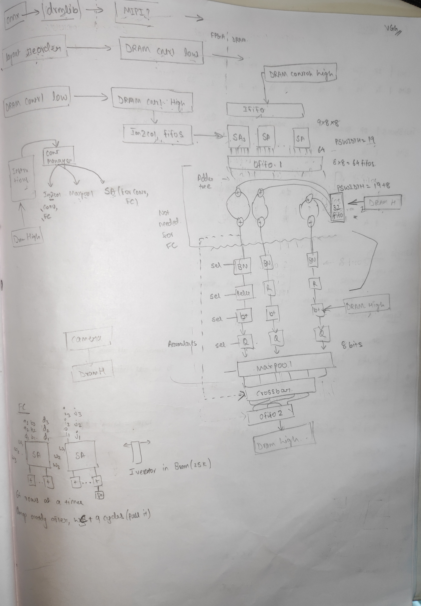
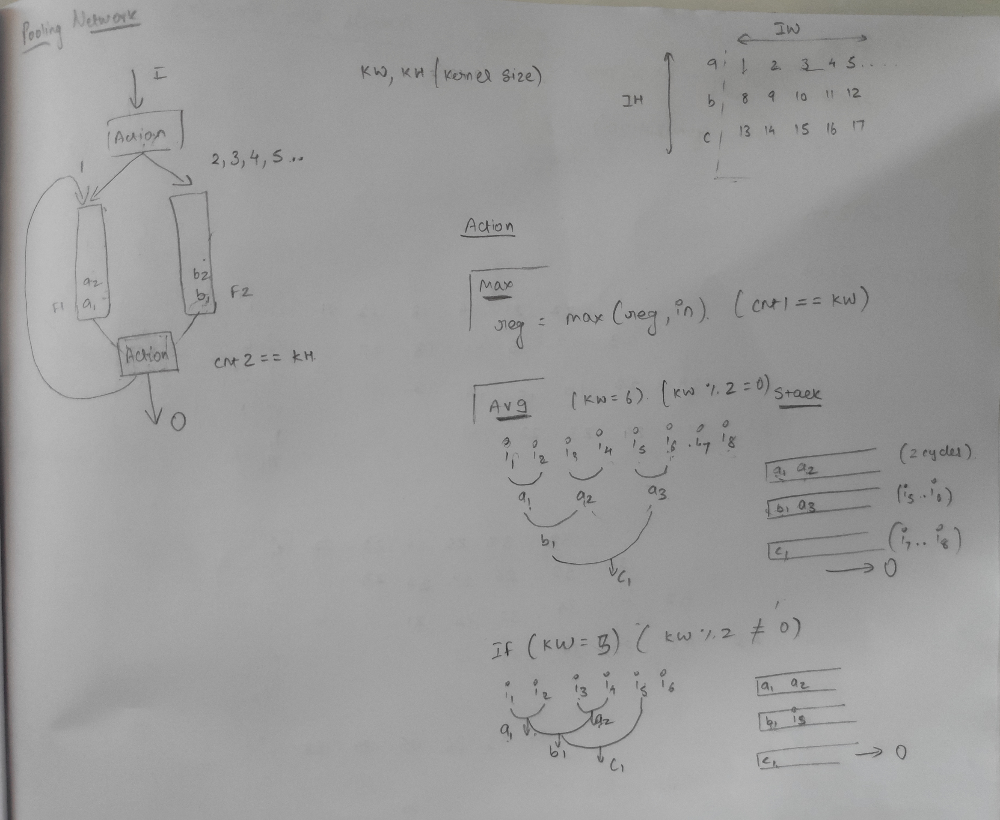
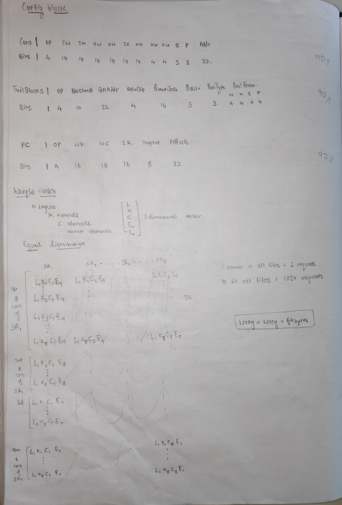
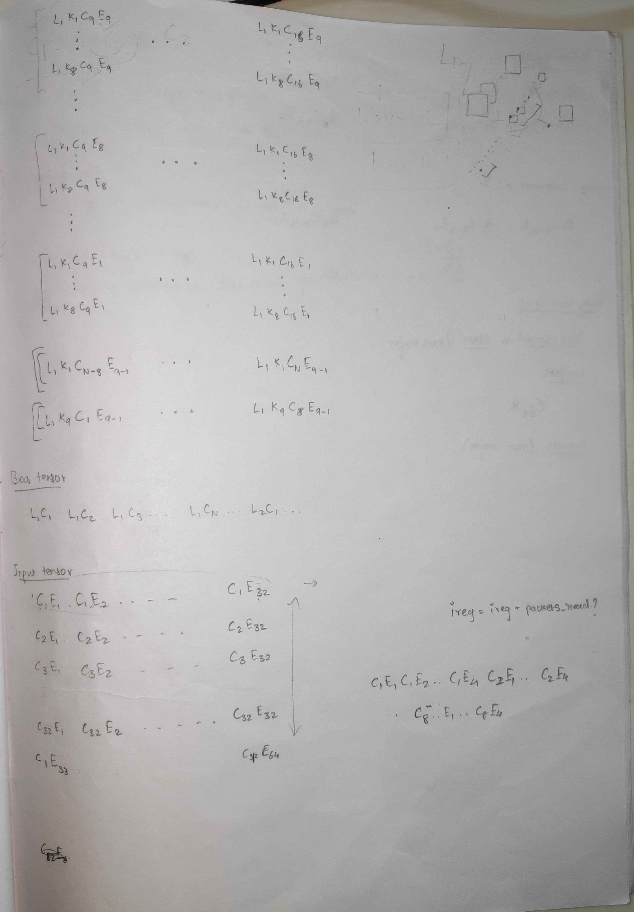
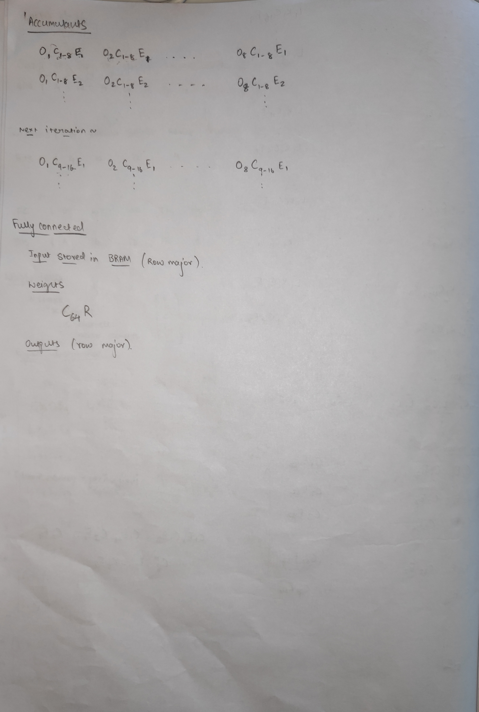

Gati
####

.. toctree::
    :hidden:

    input_blocks
    sa
    quantization

.. contents:: Table of Contents
   :local:
   :depth: 3

Here's a Bird's eye view picture of the entire CNN architecture:

Following sections describe what each block in the image above does.

ONNX
****

:term:`ONNX` involves reading the model file on the CPU, transforming (eg, from
:term:`Row Major Order (NCHW)` to :term:`Channel First Layout (NHWC)`), optimizing (eg, operator fusion), reading images
from the user and trasmitting it to the FPGA. This process happens exclusively
on the CPU (:term:`RK3399`).

Drmlib/MIPI
***********

This is a set of lower level linux drivers that transmit data via :term:`MIPI`
to the FPGA.

DRAM Controller
***************

Can be seen as two entities:

1. DRAM Controller (LOW):
   This is ML agnostic (i.e. has no idea what channels, kernels, ifmap,
   iterations etc.) are. This is the part that directly communicates with the
   AXI interface provided by :term:`Trion120`.

2. DRAM Controller (HIGH):
   This understands ML. Schedules requests to the LOW controller with addresses
   and corresponding data buffers, manages addresses (increment, decrement
   etc.), handles pre-fetching and scheduling of requests.

Input Blocks
************

The input block includes the blocks that read (in most cases) from the DRAM
and bring data to the Systolic array. This includes:

1. Inputs
2. Weights
3. Biases
4. Partial Sums (Accumulants)

Please see :ref:`input_blocks` for more information.

Systolic Array
**************

Gati currently assumes to have 8 units 9x8 weight stationary systolic
array. Each of these units is called a compute engine. A compute engine
is a 2D grid of processing elements arranged in 9 rows and 8 columns.
our choice of 9 rows is because of filter size of VGG16, i.e., 3x3 -
having a compute engine that is coherent in size with filter size
simplifies the dataflow design; however this could be extended to other
filter sizes. each 3x3 filter here can be visualized as a column of 9
elements. Thus all 9 weights of a filter can be exactly fit to compute
engine’s column. in 8 columns of compute engine 8 unique filters can be
pre-loaded. so, in each of 9x8, first 8 filters are loaded, respective
to the engine. After completion of loading weights, each compute engine
is set to accept inputs. 8 engines in-parallel accept first 8 channels.
partial-sums are collected (and added) before passing to the tail
blocks. Tail blocks apply activation functions (e.g. relu), dropout, and
perform operations like downsampling (e.g. maxpooling); in some cases
(transform to row-major format). Finally, the data is staged in FIFOs to
be written back to DRAM.

Systolic Array here is combination of one or many compute engines.
current version of SA assumes a weight stationary Processing element for
convolution layers and output stationary for fully connected layers.
configuration block instructs to switch weight stationary to output
stationary. exploring other dataflows (e.g. row stationary) for
convolution layers is a future work.

Refer to :ref:`sa` for more info.

Output Block
************

.. TODO
   a good diagram here would be very nice

1. opFIFO set1: FIFOs at immediate output of SA.
2. Adder **trees** between compute engines
3. opFIFO set2: FIFOs to stage DRAM reads (these are the partial sums of
   previous layers) or 
   
   True dual port RAM: To stage DRAM reads (partial sums of previous
   layers) and the inputs for fully connected (FC) layer.
4. adder stage between results of previous adder tree and staged data in
   set2.
5. delay registers
6. crossbar and configuration design.
7. opFIFO set3: FIFOs at the output of the crossbar.

**opFIFO set1**: these FIFOs are present at the output of systolic array
to collect the partial sums from each column of systolic array. thus,
set1 has 64 FIFOs. one FIFO for each column.

**Adder Tree Set1**: the number of adder tree in set1 is equal to number
of columns in each compute engine. adder tree is log N complexity, where
N is number of inputs. stage 1 of each adder tree is capable of
``ceil(compute engines / 2)`` additions. in our case with 8 compute
engines, each adder tree in stage 1 has 4 addition operations. in total
set1 has 56 addition operators.

**opFIFO set2**: these FIFOS stage the accumulations of partial sums
(previous 8 channels) reads from DRAM to be added with accumulations of
current 8 channels. opFIFO set2 has 32 FIFOs to accommodate DRAM read.
(or)

**True dual port (TDP) RAM**: This memory is virtually divided into two parts,
wherein one part (say, port A) is reserved for staging the accumulations of 
partial sums (previous 8 channels) read from DRAM and added with accumulations of
current 8 channels. The another part (say, port B) of the memory stores the input 
data for computation of FC layer and read sequentially to feed the SA. There are 
32 TDP RAM blocks to accomodate DRAM reads and FC inputs.

**Adder Stage**: It performs element wise addition on **opFIFO set2** data 
and results from **adder tree set1** before forwarding to the delay registers 
block. The number of adders present in this stage are equal to number of 
columns in SA engine (8 in this case). This stage  accepts input from 
opFIFO set2 (8 elements at a time) and output of adder tree set1 (also 8 elements).

**Delay Registers Block**: these registers align incoming data so that
crossbar enables transformation of data into row-major format required
for next layer. thus is only enabled after adder tree set2 after
accumulating all the channels. Moreover, implementation need not be dead
on as described. You may realize very soon that it is not practical to
add many registers because adding many registers physically is not a
scalable solution. *An alternative approach is to use counters to create
the delay without the registers*.

+--------+--------+--------+--------+--------+--------+--------+--------+
| S      | S      | S      | S      | S      | S      | S      | S      |
| A-col1 | A-col2 | A-col3 | A-col4 | A-col5 | A-col6 | A-col7 | A-col8 |
+========+========+========+========+========+========+========+========+
| -      | -      | -      | -      | -      | -      | reg    | reg    |
+--------+--------+--------+--------+--------+--------+--------+--------+
| -      | -      | -      | -      | reg    | reg    | reg    | reg    |
+--------+--------+--------+--------+--------+--------+--------+--------+
| -      | -      | reg    | reg    | reg    | reg    | reg    | reg    |
+--------+--------+--------+--------+--------+--------+--------+--------+
| reg    | reg    | reg    | reg    | reg    | reg    | reg    | reg    |
+--------+--------+--------+--------+--------+--------+--------+--------+
| x      | x      | x      | x      | x      | x      | x      | x      |
| bar-I1 | bar-I2 | bar-I3 | bar-I4 | bar-I5 | bar-I6 | bar-I7 | bar-I8 |
+--------+--------+--------+--------+--------+--------+--------+--------+

.. note::
    
  `reg` here is an 8 bit register.

**Crossbar And Configuration Design**: Each NN layer expects data to be
in row-major format. But the way that systolic array operates cripples
the data format. To arrange back to row-major order, we use Delay
Registers and crossbar pair. (first Delay Registers, followed by
crossbar).

crossbar is N input and N output switch. Depending on the configuration
there is one-to-one mapping of input to output ports. using the
**crossbar alone** will not provide row-major formatting. However, with
a sequence of correct configuration settings to crossbar and Delay
Registers, we can achieve the required format that next layer expects.
So configurations are to be such that when a read is issued on this (in
future), first 4 bytes of 32 bytes DRAM read should consist of engine 1
data; byte 5 to byte 8 should have engine 2 data and likewise bytes for
other engines are available in above manner. This data rearrangement is
enabled by crossbar and Delay Registers.

On the other hand, if data reordering is not required (such as partial sums
of a layer and FC computaional data) then configuration settings for crossbar
are provided such that it should pass the data to the ouput in the same format 
as it receives. 

.. note::

  PS: Our current version with 9x8 x8 assumes that all im2cols are
  synchronously feed from the incoming DRAM data. For a DRAM read (32
  bytes), each compute engine is delivered with 4 bytes. To accommodate 4
  byte at each engine, it is also assumed that few registers (e.g. 256bit)
  are available. you may notice that the number registers available limits
  the burst-read length.

**opFIFO set3**: is available at the of crossbar to collect and stage
the output before issuing a write to DRAM. note that due to delay
registers it takes 7 cycles to collect 32 bytes of data, 11 cycles to
collect 64 bytes of data. so only after 7 cycles (11 cycles) a DRAM
write (burst 2) can be issued.

Tail Blocks
***********

.. TODO:
   These sections

BatchNorm
=========

:term:`BatchNorm` is a weighted (4 different weights: mean, var, alpha and beta) block just like
the Bias block except the weights are tensors equal in dimension to the previous
layer. Batchnorm requires a multiplication and a division of input (x) with
constants.  This type of operation can usually be fused into previous
convolution layers thus reducing the need for a hard-implementation. For eg, an
Ofmap of size (96,7,7) would need a batchnorm of dimension (96, 4).

ReLU
====

:term:`Relu` is a simple conditional activation function.

Bias
====

Bias is scalar addition operation of a constant with incoming value. 

Quantization
============

:term:`Quantization` is needed because partial sums from the SA are the result
of MAC of multiple 8-bit elements which results in a number that does not
fit in 8 bits. This block makes a PS of larger bit-width fit in 8 bits. 

Refer to :ref:`quantization` for more info.

Pooling Network
***************

Pool Movement
=============

:term:`Pooling` can be understood as two tasks: movement and action.
The movement has parameters: window size, stride and padding that dictate how
big the kernel is and how it should be moved across the Ifmap. Action is
what has to be done to the values in the kernel. Commonly found actions
are Max and Average which gives the name of two popular pool layers: maxpool and
average pool.

Following image shows the pooling network on the left:

The action block can be replaced by any action while leaving the movement
(everything other than action) untouched. 

Assume a pool of window size (KW, KH), stride (S) and padding (P). Movement works thusly:

1. Input I (a scalar value) arrives out from the output fifo 2 into the action
   block.

2. The action block (discussed later) emits another scale value (after some
   cycles) and stores into F1.

3. Once an entire row has been processed, F1 should be filled with some elements
   and F2 should be empty.

4. For second and all subsequent rows (till KH), values from action are sent
   to F2

5. Once a value enters F2, one value from both fifos F1 and F2 (in the diagram,
   the values a1 and b1) are sent to the second action block which runs the
   action on it.

6. Value from this action block is written back into F1 if the current row is
   not the last row, else it is sent out from the pooling network.

Pool Actions
============

Max
---

The max operation takes max b/w two values at a time and stores it 
in a register to use the same value for next comparison. Initially,
the value of reg would be 0. This operation is carried out KW times,
then the value of reg is emitted out of the Max (action) block.

Average
-------

Average b/w N elements requires division by N (a variable) which is not very
convenient on the FPGA. Average of a N element array can be cheaply calculated
by calculating average of 2 values at a time then averaging these averages. This
results in a tree like structure (as represented in lower right corner of the
image). Moreover, division by 2 is simply a right shift by 1.

.. TODO
   add running_averag script to vaaman-vgg-benchmarks

Consider a window size of 6. We need to take 4 averages to calculate an average
of 6 elements. Average block works thusly:

1. Avg of i1 and i2 is calculated (a1) and push to a fifo. In subsequent
   cycles, average of i3 and i4 is calculated (a2) and also pushed to the fifo. 

2. If the fifo has 2 values, average b/w the two is taken and pushed in the
   fifo. 

3. This is done till there is only one value left in the fifo. This is the
   average.

For a odd-numbered window size, say 5, nothing changes except we only have to
take one less average. The extra element is pushed as is in the fifo.

Right shift by 2 of a integer divides it but gets rid of the decimal part (.5)
which may cause a loss in precision. Empirical evaluation shows that the loss
occured is 0.5 to 1.0% of the original which should be acceptable.

Concrete Example of a Pool (Maxpool)
====================================

You may notice that maxpooling in VGG16 is with 2x2
kernel and stride 2. Consider a 224x224 matrix. First maxpooling is
operated on elements 1,2,225,226 - these are first two-elements of
rows 1 and 2. Second maxpool is on elements 3,4,227,228. however,
partial sum that are generated which eventually feed to maxpool are
in row-major order. thus 225,226 will not be present in immediate
next cycles of elements 1,2. This is a problem. so our first goal is
to solve maxpooling operation for incoming elements in row-major and
at the same time we should preserve pipelineing that enables high
throughput. To achieve this, maxpooling is done in three steps:

1. Phase1 comparison. compares two elements at a time and outputs the greater
   element. e.g. cycle1 compares elements 1 and 2. cycle 2 compares elements 3
   and 4. *be sure not to compare elements 2 and 3 in cycle 2*.  

2. FIFO1 to stage results from phase1. back to our example matrix, 224x224. In
   row1, we have 112 comparisons. so, the FIFO stores 112 values. so head of
   the FIFO points to greater value in elements 1 and 2. second FIFO index
   points to greater value in elements 3 and 4 and likewise till elements 223,
   224.  
   
3. We then start row2. Here perform phase1 comparison. But now we do not push
   the result to FIFO instead push to phase2 comparison.  
   
5. Phase2 comparison.  compares two elements at a time and outputs the greater
   element. operand one is element that is read from FIFO1 and operand two is
   result from phase1 comparision. the final result of maxpooling operation is
   obtained after phase2. you may visualize that odd rows are first pushed to
   FIFO while the even rows are directly forwarded to phase2 comparison.

Memory Layout Of DRAM
*********************

.. TODO

.. note::

   This is block is still under development. Will likely undergo drastic
   reforms.

When finalizing the memory layout factor in all the values that are to
be stored in the DRAM.

1. configurations
2. biases
3. values of batch normalization (not required for VGG16)
4. input feature maps for N images
5. weights for convolution layers and fully connected layers
6. intermediate channel outputs
7. layer outputs

Here's the memory layout for Input, Weights, Biases and intermediate channel
outputs:

Configuration Block
*******************

.. TODO

.. note::

   This is block is still under development. Will likely undergo drastic
   reforms.

.. include:: instructions/inst.rst

Configuration block stores required configurations for each layers and
programs input, output, and tail blocks ahead of time so that they can
immediately switch to new settings after completion of the current layer
and start processing next layer. 

Each table above shows a config packet of 128 bits. Understand these
packets as instructions where the instruction width is 128. None of the
above configs currently take all 128 bits, this is not a problem, these
least significant remaining bits can be assumed to be reserved.

.. sectionauthor:: Shreeyash Pandey (@bojle)

End to end flow for a given layer 
*********************************

.. note::

  This flow abstracts microarchitecture details

Default State
==================

What is the default state?

The system is in its default state when it is idle and only the DRAM has
been initialized. i.e., DRAM contains the input images, weights, and
configurations required for input/ output, and tail blocks. The weight
and im2col FIFOs are both empty.

Start im2col Block
=====================

Our im2col profile analysis revealed that it has a ~450 cycle cold start
time. So, this takes precedence over the weight block. However, this is
a one-time occurrence and is not a recurring tendency. Requests for
im2col and weights blocks are handled on a first-come, first-served
basis at a later stage. The idea is to understand the execution pattern
so that we can postpone few requests to a later point in time as all
requesting-blocks (e.g. im2col and weight blocks) might not need the
data right away.

.. note::

  1. The cycle difference between the first im2col column entering row FIFO and
     the cycle when the first column from FIFOs is pushed into SA is referred
     to as the “cold start time” in this context.  We must acknowledge that
     the data is biased because of im2col’s design.  Therefore, it takes 450
     cycles for us to reach the point where every row is available, each
     containing at least one element, and is therefore prepared for pushing
     into the SA.

  2. See :ref:`bounding_squares` im2col architecture for more understanding on
     this 450 cycle latency.

Start Weight Block
=====================

We handle requests from the weight block after the memory controller
responds to an im2col request. A burst read request can be sent at first
by weight blocks. DRAM can write up to (512x32 bytes of data) in this
scenario. The process is atomic for the first 288 bytes of data. (SA is
responsible for this. The first step is to pre-load the weights into
specific weight buffers in the SA PE. This corresponds to 288 bytes in a
9x32 SA grid.) It may be interrupted for later bytes if there are more
requests to handle by memory controller. At this point, weight block can
accept any external commands to push data to SA once 288 elements are
available.

Message Passing Between Im2col And Weight Blocks
===================================================

Before delving into the explanation of message passing, it is important
to keep in mind that while all other blocks can initiate data requests,
only the dram block can initiate configuration requests. Message passing
between weight block and im2col makes sure that pushing input and
flashing SA (loading weights): (1) Properly pushed into SA to prevent
premature flashing and contaminating the current weights. (2) Before
adding the next channel or switching to a new layer, a given input
channel must only be iterated a set number of times. (The terms
“channels” here refer to the three original RGB channels or the layer N
output’s k channels, which serve as layer N+1’s input.)

The main questions we address here are: (1) How long must weights be
stationed in SA, or, alternatively, when should we flash SA with new
weights? (2) The number of iterations a channel must undergo on SA
before switching to a new channel is limited.

1. The number of times a channel needs to load? Every time SA is
   flashed.
2. How many flashes of SA are necessary? -> (a) Is dependent on the size
   of the SA column. (b) is dependent upon #unique kernels. For example,
   layer 1 in VGG16 contains 64 distinct kernels, whereas the column
   size in our SA is 32. Thus, ``(#kernels / SA col size)`` is the
   formula for the number of times SA needs to be flashed. In this case,
   64/32 = 2.
3. When must SA be flashed? -> after the final column of the expanded
   matrix that is pushed into SA, or at the end of im2col. Here, a
   counter is required to keep track of this. The expanded matrix for a
   224x224 input matrix has columns equal to 50176 columns, which is the
   same as 224 multiple times 224.
4. When does one need to load a new channel? Following the push of #SA
   flash times by the current channels.

This is one possible approach with decentralized control. Nevertheless,
we leave this to implementation on how to manage the im2col block,
weight block and incoming configurations from configuration block. Other
approach is to have a centralized control that decodes the configuration
and manages weight and im2col blocks.

Accumulating the output partial sums.
========================================

For each SA flash, we iterate a channel once in our current data flow.
The output FIFO has the partial sums and convolution outputs, which are
then sent to DRAM. The partial sums of kernel<1> on all channels must be
added together in accordance with the NN algorithm. However, according
to our algorithm, these partial sums of other channels are neither
immediately accessible nor can previous channels be stored and
accumulated using on-FPGA BRAM due to their large sizes. We therefore
came up with this plan to control the accumulation of output partial
sums.

To do this: First, the DRAM controller receives the output partial sums
from SA, which are then written into DRAM. Second, the previous
channel’s output is read from DRAM and is currently awaiting the
addition of the subsequent channel’s partial sums. Third, a vector
addition unit (an adder tree) receives both incoming and just-from-DRAM
psums for the purpose of adding. Fourth, the total is written back. This
is a pipelined and iterative process. All of the accumulation has
already been completed by the time the final partial sums from SA
arrive. Final accumulation happens shortly after the DRAM controller
receives the output psum of the final channel from SA. These psum
deposits can now be used as input to the next layer.
