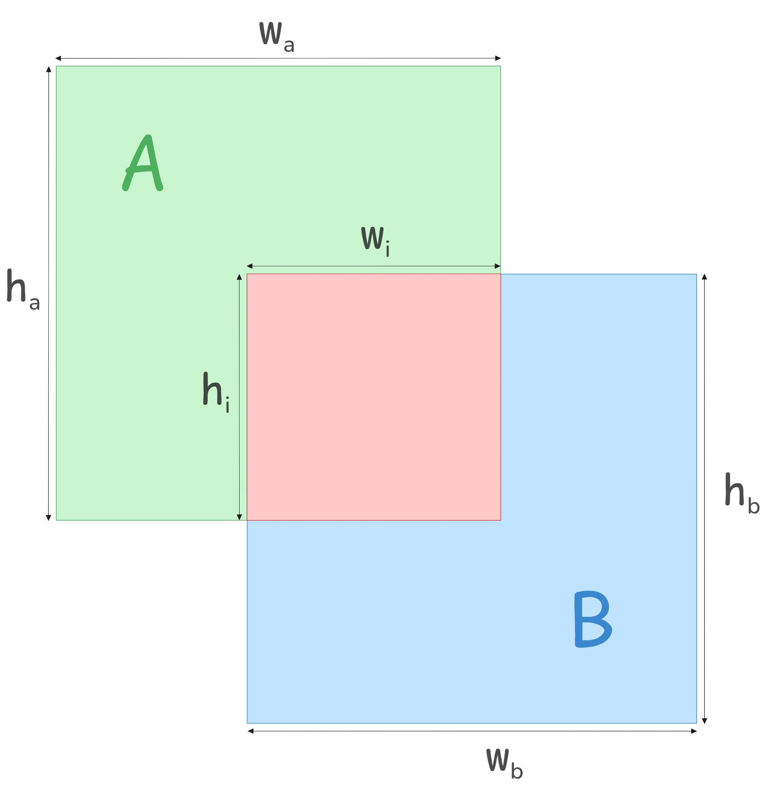

.. _nms:

NMS
###############################

.. TODO
   Explain NMS

IOU
**********
**Intersection Over Union (IOU)**, also know as *Jaccard Index*, is a metric used to
measure the overlap between two regions. It is defined as:

.. math::
   IOU = \frac{\text{Area of Intersection}}{\text{Area of Union}}

In object detection, **Intersection over Union (IOU)** is essential for assessing the 
accuracy of predicted bounding boxes against ground truth boxes. Models like **SSD**, 
**Faster R-CNN**, and **YOLO** incorporate IOU in their training pipelines to measure 
localization performance effectively.

Beyond evaluation, IOU plays a crucial role in **Non-Maximum Suppression (NMS)**. By 
comparing IOU scores, NMS eliminates redundant detections, ensuring that only 
the most confident predictions are retained. This significantly enhances detection 
efficiency and reduces false positives.

**IOU Calculation**

In the figure above, two overlapping boxes are shown: **Box A (Green)** and **Box B (Blue)**. 
The intersection area is highlighted in **Red**.

* Box A has a width of  :math:`w_a` and a height :math:`h_a`.
* Box B has a width of :math:`w_b` and a height :math:`h_b`.
* The overlapping region (intersection area) has a width of :math:`w_i` and a height of :math:`h_i`.

The IOU metric is calculated as:

.. math::
   :label: iou_original
   
   IOU = \frac{w_i \times h_i}{(w_a \times h_a) + (w_b \times h_b) - (w_i \times h_i)}

Here, the numerator represents the intersection area, while the denominator 
accounts for the total area of both boxes, avoiding double-counting.

**The Computational Challenge**

While this formula precisely computes IOU, it requires three multiplications 
and one division. Division is particularly expensive in hardware compared to 
addition and subtraction, making direct IOU computation inefficient for real-time 
applications like object detection, where thousands of bounding boxes must be 
processed per frame. To address this, :cite:`Ch Yu. 2023<chyu2023>` proposes an approximation 
based on perimeters rather than areas, significantly reducing the computational 
complexity while maintaining accuracy.

**Perimeter-Based approximation**

To avoid expensive division operations in hardware, we approximate the area 
using perimeters instead.

*Defining Perimeters:*

* Perimeter of Box A: 

.. math::
    p_a = 2(w_a + h_a)

* Perimeter of Box B:

.. math::
    p_b = 2(w_b + h_b)

* Perimeter of intersection: 

.. math::
    p_i = 2(w_i + h_i)

We approximate the areas using squared perimeters:

:math:`\text{Area of Intersection} \approx (p_i)^2`

:math:`\text{Area of Union} \approx (p_a + p_b - p_i)^2`

Rewrite the IOU Condition

.. math::
   :label: iou_perimeter_form
   
   \frac{(p_i)^2}{(p_a + p_b - p_i)^2} > IOU

Taking Square Root on Both Sides 

.. math::
   :label: sqrt_step
   
   \frac{p_i}{p_a + p_b - p_i} > \sqrt{IOU}

Let:

.. math::
   :label: iou_root
   
   I' = \sqrt{IOU}

Substituting :math:`I'` in the equation:

.. math::
   :label: rewritten_sqrt
   
   p_i > I' (p_a + p_b - p_i)

Moving the terms to one side:

.. math::
   p_i > I' (p_a + p_b) - I' p_i

.. math::
   p_i + I' p_i > I' (p_a + p_b)

Taking :math:`p_i` common:

.. math::
   p_i(1 + I') > I' (p_a + p_b)

Dividing both sides by :math:`(1 + I')`:

.. math::
   :label: final_perimeter_version

    p_i > \frac{I'}{1 + I'} (p_a + p_b)

Substituting Perimeter Values

.. math::
   :label: final_normal_version

   w_i + h_i > \frac{I'}{1 + I'} \left( (w_a + h_a) + (w_b + h_b) \right)

Here, :math:`I'` is fixed and serves as a threshold for determining bounding box 
overlap using a computationally efficient perimeter-based method.

**Why This Approximation**

#. Eliminates Costly Operations
   
   * The original IOU formula involves three multiplications and one division, both of which are computationally expensive.
   
   * In contrast, the perimeter-based approximation relies only on addition, subtraction, and a precomputed multiplication (which can often be replaced with efficient bit-shifting).

#. Optimized for Hardware

   * Addition and subtraction are significantly faster than multiplication in hardware implementations.

   * The fixed value of :math:`I'` enables further optimizations, reducing computational overhead.

#. Maintains Effectiveness for NMS

   * Despite being an approximation, this method preserves the relative ranking of overlapping boxes, ensuring that Non-Maximum Suppression (NMS) still functions effectively.

   * As demonstrated in [x], the accuracy loss is minimal, making this approach highly practical for real-time object detection.

