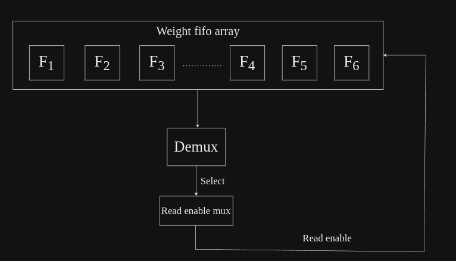

# Fifo Sharing Controller

This controller assists in transferring weights from the weight FIFO array into either SA or FC blocks, 
alternating between them one block at a time based on their weight requirements.
The goal is to utilize the same FIFO array for both SA and FC, thereby minimizing resource usage 
and eliminating redundant weight FIFO arrays in each block.

## Description of working of this controller
This fifo sharing controller consist of mux, demux and weight fifo array.
Here's a description of working of this fifo sharing controller:

1.  **Loading weights into weight fifo array:** 
    - A separate block(excluded in this controller) handles writing weight from DDR into weight fifo array.
    - Number of fifo in weight fifo array depends upon the configuration of SA and FC controllers.
    - This is how number of fifo in weight fifo array is calculated:
        * if((N_SA * COL_SA) > COL_FC), then number of fifo in weight fifo array will be equal to (COL_SA * N_SA)
        * if(COL_FC > (N_SA * COL_SA)), then total number of fifo in weight fifo array will be equal to COL_FC.
    - Hence, as per the given logic and conditions, it is obvious that total number of fifo in weight fifo array will always be equal to maximum number of dimension, at a given instance of time, whether it be SA's or FC's dimension.
    - For example, in case of 9x4x4 SA and 1x32 FC dimension, there would be 32 fifo in weight fifo array.
    - Likewise, for 9x8x8 dimension of SA and 1x32 dimension of FC, there would be 64 fifo in weight fifo array.

2.  **Demux to send weights into either SA or FC blocks:**
    - Based upon the value of opcode coming from instructions, this demux will either send weight and other required data of weight fifo array into SA or FC.
    - Desired value of opcode for sending weights into SA and FC must be given to parameters, with which the input opcode will be compared in order to send data ahead into desired block.
    - When weights are to be loaded into FC, the weights from each fifo in weight fifo array will be loaded into each PE block in FC block.
    - While loading data into SA, if following conditions gets true:
         (COL_SA * N_SA) < N_DRAM_BYTES  
    then, entire SA block(consisting of multiple engines) will be first divided into two halves(virtually), initially, first half will receive weights, then switching will be done by toggling of sel signal coming from weight fifo array's read enable controller located in SA block.
    - The toggling of sel line will happen once iteration done saignal is received, then sel signal's value will be held until layer done signal is not received.
    - Once, this layer done signal is received, it will again start the same procedure, of switching between two halves of SA engines to load weights.
    - Else, if following condition gets fulfilled,:
         (N_SA * COL_SA) >= N_BRAM_BYTES  
    then, weights from all the fifo in weight fifo array will be read together in the SA engine, just like the way the weights are loaded into FC block.

3.  **Mux to handle read enable signals coming from SA and FC for loading weights into them:**
    - Both, SA and FC have their own controllers to handle read enable signal of weight fifo array. 
    - This mux takes the read enable signals from both the blocks together and, based on opcode and select signal(coming from SA to toggle between SA engines).
    - And sends read enable signal of either one of them to the weight fifo array, assuring to load weights into either SA or FC at a given instance of time.
        
## Parameters used in design

- `N_SA`: Number of SA engines
- `COL_SA`: Number of columns inside each SA engine
- `COL_FC`: Total number of columns in the FC block
- `N_BRAM_BYTES`: Number of bytes read from BRAM in one clock cycle
- `OPCODE_SA`: Desired value be compared with input opcode, to indicate waeights to be loaded into SA from fifo sharing controller
- `OPCODE_FC`:  Desired vallue to be compared with input opcode, to indicate to load weights to be loaded into FC in fifo sharing controller