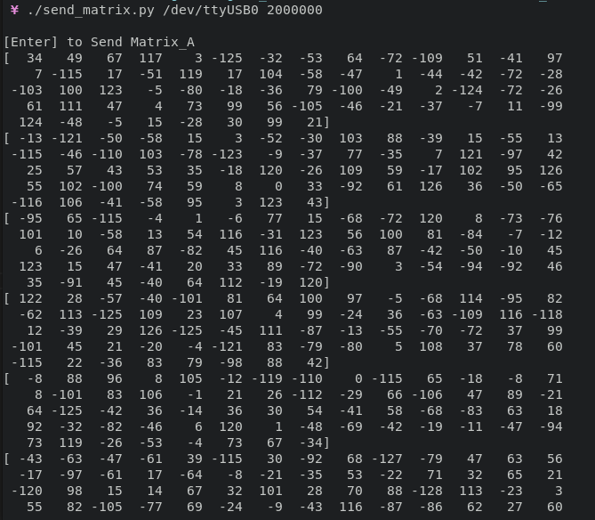
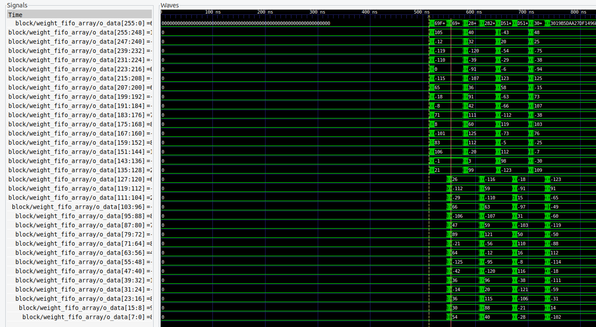
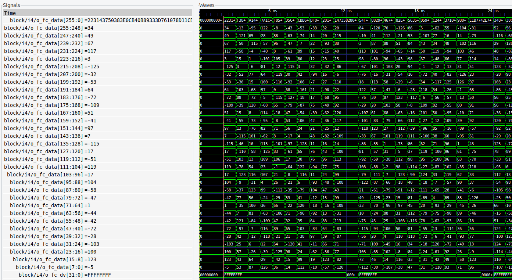

# Fifo Sharing Controller Implementation

## Overview

This document outlines the steps for implementing and verifying weight fifo sharing controller. The design utilizes scripts to transmit matrices to the FPGA via PySerial. The design's functionality is verified through comparison with expected outputs.

## Implementation Steps

The implementation process involves several steps to ensure the proper transmission of matrices. Follow these steps:

1. Execute the script for sending the weight matrix using the following command:
    ```bash
    ./<FILE_NAME> <PORT> <BAUDRATE>
    ```
    Replace `<FILE_NAME>`, `<PORT>`, and `<BAUDRATE>` with appropriate values.

2. When prompted with "Enter to send weight matrix" in the terminal, connect the `i_opcode` wire with ground on the board if switching is not required,
    else, connect it with VCC if switching is required.

3. Now, connect `i_start` to ground on the board to give a trigger pulse to the read enable controller present inside SA and FC block.
    If this input's GPIO is other than LED, then connect it to VCC to send a trigger pulse. Once done, disconnect the cable.

Note: If `i_rstn` is connected to ground, no output would be achieved as the design would be in reset condition, since, the controller uses active low reset. Make sure that this gpio is not connected to ground while implementing fifo sharing controller on the board.

## Output Analysis

Matrix sent by the script serially to the controller:


Weights going into SA while switching between two half of weight fifo array:

Above given image shows switching between the weight fifo array for loading data into SA engines

Weights going into FC altogether of all the fifo in array:

Above given image shows weights loading into Fully Connected layer with dimension of 1x32
