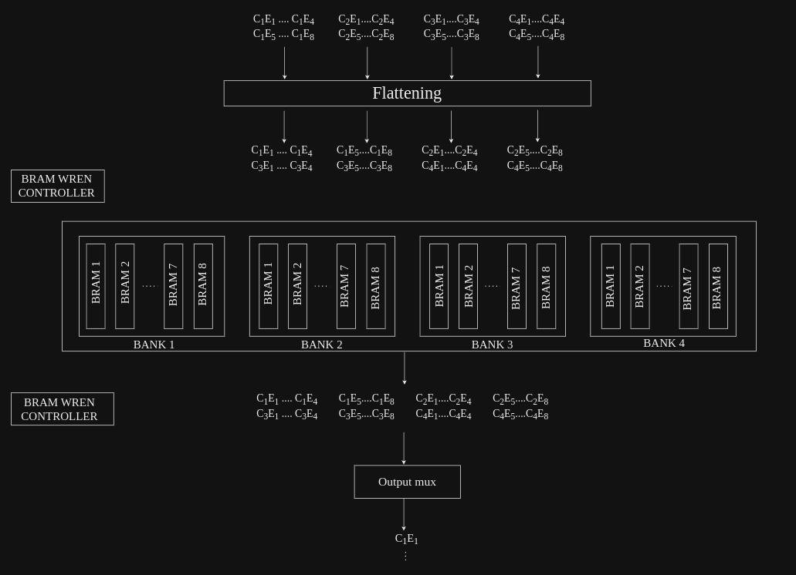

# Flattening
This controller takes output of last convolution layer from DDR, converts it into one dimension, and send it into fully connected layer. The purpose of doing this is because the fully connected is receiving input image in one dimension. 
This controller consist of flattening, BRAMS and controllers to write and read flattened data into and from the BRAM array.

## Following is the description of working of controller:

Below given is block diagram showing modules included in flattening controller: 
 
 Note: The architecture of flattening shown above is for SA dimension 9x4x4, 
          number of banks and bram in a bank, and elements of channel loading into BRAM changes w.r.t. dimension of SA.

This flattening controller consist of following blocks:
1. Convolution output reorder:
    Output coming from convolution is reordered in desired way.

2. BRAM brank array:
    - There exist 'm' number of BANKs, each having 'n' number of BRAMs.
    - Size of each BRAM is 8 x 1024.
    - The reordered data gets stored into this BRAM bank array.
    - Data stored in each BANK in in row-major order of it's corrosponding channel.

3. BRAM write enable controller:
    - Handles the write enable signal and write valid reordered data into BRAM bank array.
    - Data is written into BRAMs in following way, despite of the value of flattening bit coming from config block:
        * Writes one byte into all 'n' BRAMs, present in all 'm' number of banks at the same clock cycle.
        * Hence, number of clock cycles taken to write data into all the BRAMs in array is equal to number of bytes to be written into each BRAM.
    - When the entire data is written into BRAMs, this controller assert done signal to indicate that it's done writting data into BRAMs.

4. BRAM read enable controller:
    - Handles read enable signal of BRAMs. It asserts the read enable once done signal is received from BRAM write enable controller.
    - The way it asserts read enable signal is different based on the flattening input coming from instructions, i.e., whether flattening is required or not.
    - Following is the way it asserts read enable signal if flattening is not required (flattening input coming from config block is 0):
        * Counters are used to read data of different BRAMs and switch between different BANKs.
        * Starting from BANK 1, one byte per cycle is read from BRAM 1 to BRAM n.
        * Followed by reading byte from BRAM 1 to BRAM n of BANK 2, and so on.
        * This continues till the byte of last BRAM in last BANK is read.
        * Now, first byte from all the BRAM is read, the counters will then switch to next address of BANK 1.
        * The same way data will be read from all BRAM, starting from BRAM 1 to BRAM n in all the BANKs.
        * Once, the entire data is read, it will wait to receive valid signal from accumulator.
        * As it receives accumulator valid signal, the image is read again in the same way for different set of kernals.
        * Once it reaches maximum count for kernals, done flag is asserted, indicating the completion of reading image for all different set of kernals.
    - If flattening is needed to be done on the data, this controllers works in the way explained below:
        * Reading data and switching of bank is similar to the way it is described in the above case, but, the only difference is when it switches the bank.
        * As described in case for flattening equals to 0, after reading one byte from all n BRAMs in a bank, the BANK is switched, here,
        for flattening equals to 1, when it reads first byte from all n BRAMs, it will still be in the same bank, and the address will be incremented of the respective bank, and it will keep on reading from BRAM 1 to BRAM n , and would again increment the address and read from BRAM 1 to BRAM n, this will go on, until it reads total bytes from all BRAMs in a bank equal to the image dimension coming from config block.
        * Once it read image dimension number of bytes from a bank, it will go to the next bank, and will read in the same way it read in the previous bank.
        * This will go on until it reads all the elements.
        * And then it will wait for accumulator valid, to read bytes again from BRAM, and will increment kernal counter as well aftrer receiving valid from accumulator. Once, it reaches maximum number of kernal count, it will assert done signal indicating completion of reading all the data.
