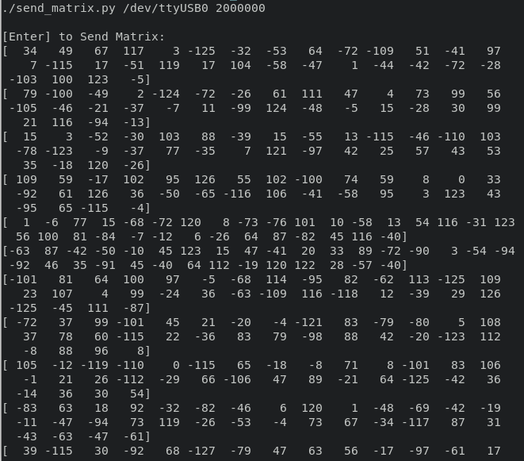
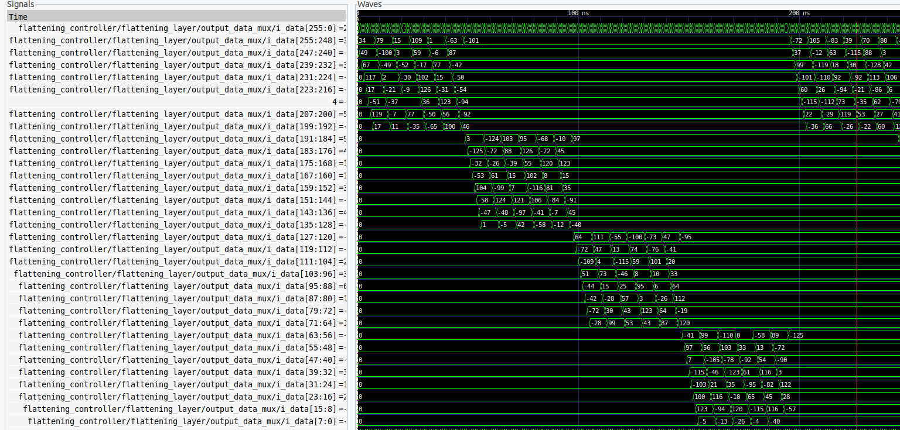

# Flattening Implementation

## Overview

This document outlines the steps for implementing and verifying flattening controller. The design utilizes scripts to transmit matrices to the FPGA via PySerial. The design's functionality is verified through comparison with expected outputs.

## Implementation Steps

The implementation process involves several steps to ensure the proper transmission of matrices. Follow these steps:

1. Connect the `i_flattening` wire with vcc on the board if flattening is not required,
    else, connect it with ground if flattening is required.

2. Execute the script for sending the weight matrix using the following command:
    ```bash
    ./<FILE_NAME> <PORT> <BAUDRATE>
    ```
    Replace `<FILE_NAME>`, `<PORT>`, and `<BAUDRATE>` with appropriate values.

3. When prompted with "Enter to send Matrix:" in the terminal, press enter to send the matrix into design.

Note: If `i_rstn` is connected to ground, no output would be achieved as the design would be in reset condition, since, the controller uses active low reset. Make sure that this gpio is not connected to ground while implementing fifo sharing controller on the board.

## Output Analysis

Matrix sent by the script serially to the controller:


Output coming from flattening controller, if flattening input is 1:


