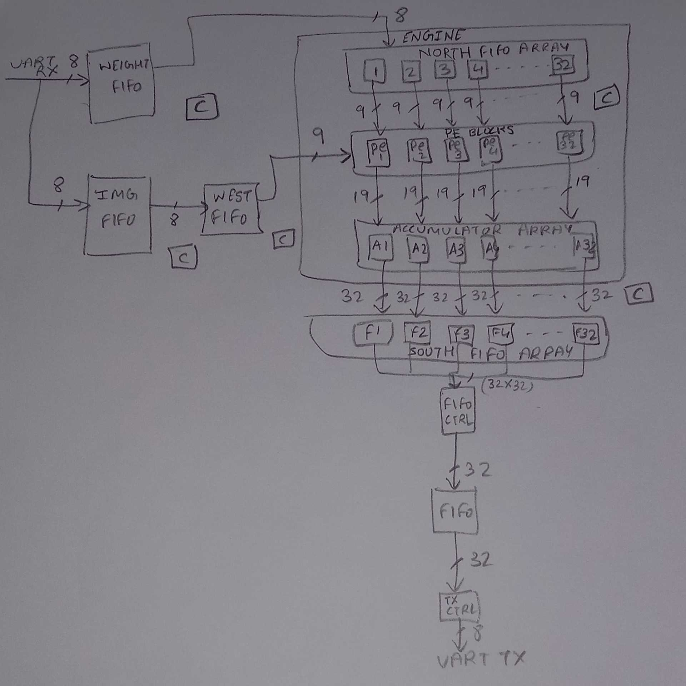

### Fully Connected:

#### 1. Overview
Fully connected layers are integral components of neural network architectures for various purposes:
- **Feature Aggregation:** They aggregate features learned by preceding layers, facilitating the capture of intricate patterns and relationships in the data.
- **Parameterization:** Introducing numerous trainable parameters enables the network to learn complex mappings between input features and output classes.
- **Classification and Prediction:** Crucial for tasks like image classification, fully connected layers amalgamate extracted features to make final predictions.
These layers are vital for enabling deep neural networks to learn from data and make accurate predictions across diverse tasks. The modified PE grid used here is of dimension 1 x 32.

#### 2. Abstract Design Flow
The design flow is divided into three sections for clarity:
1. **Input Block:** Incorporates UART receiver, fifo, and controllers for loading data into PE blocks.
2. **Engine:** Fifo array, PE grid, controllers for data movement, and accumulator.
3. **Output Block:** Consists of fifo array, controllers, and UART transmitter for storing and transmitting accumulated output.

 

#### 3. Detailed Design Flow
1. **Input Block:**
   - This block operates in i_clk clock domain.
   - Data from UART receiver is stored in fifos, with separate fifos for weights and images.
   - Weight fifo feeds into the north fifo array inside the engine, while the image fifo (west fifo) is outside the engine.
   - Controllers manage fifo read and write operations.

2. **Engine:**
   - Handles main computational tasks, operating in the s_clk clock domain.
   - Weight flow: Weights enter 32 fifos in the north array and move into PE blocks alongside images.
   - Image flow: Images are directly broadcasted into PE blocks from the west fifo.
   - Computation and accumulation: PE blocks compute outputs, which are accumulated in the accumulator.
     - In the VGG16 architecture, outputs from PE blocks are accumulated for every 25K values.
     - Accumulator output is adjusted to 32 bits by appending MSB to 19-bit partial sums.

3. **Output Block:**
   - This block operates in i_clk clock domain.
   - Engine output is stored in 32 fifos (south fifo array).
   - Data from these fifos is transferred sequentially into a single fifo using controllers.
   - Output data is then sent to the UART transmitter in 4-byte chunks, as UART operates with 8-bit data.

