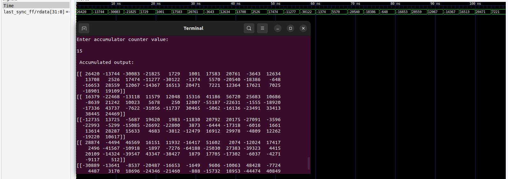
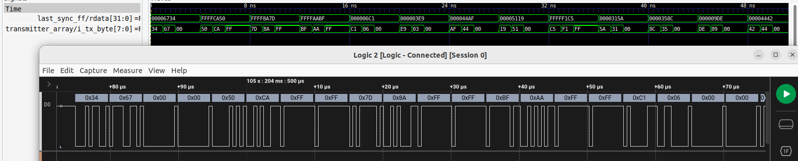

# Design and Implementation

## Overview

This document outlines the steps for implementing and verifying design on an FPGA (Field Programmable Gate Array). The design utilizes scripts to transmit matrices to the FPGA via PySerial. The design's functionality is verified through comparison with expected outputs.

## Implementation Steps

The implementation process involves several steps to ensure the proper transmission and processing of weight and image matrices. Follow these steps:

1. Execute the script for sending the weight matrix using the following command:
    ```bash
    ./<FILE_NAME> <PORT> <BAUDRATE>
    ```
    Replace `<FILE_NAME>`, `<PORT>`, and `<BAUDRATE>` with appropriate values for your setup.

2. When prompted with "Enter to send weight matrix" in the terminal, connect the `sel_1` wire with ground on the board and press enter to send the weight matrix to the FIFO north array. Once the matrix is sent, disconnect the cable.

3. Send the image matrix to the pe blocks by connecting the `sel_2` signal to ground on the board and press enter to transmit the image matrix. Once done, disconnect the cable.

4. Now send the trigger to load weights and image together into PE blocks. Connect the `trigger_1` cable with ground on the board and remove it as soon as it gets deasserted to ensure the trigger is sent only once. Whenever a new set of weights and image needs loading into the PE blocks, this trigger must be sent.


## Verification of Design Functionality

To ensure the precision of the design output, additional Python logic in the script executes the same operation on the input weight and image matrices, saving the output in "output.txt." Verification entails examining the serial output (accumulated output) using Saleae Logic Analyzer.

### Comparison Steps:

1. On the terminal, the inputs weight and image matrices will be printed in the way they are sent into the design, followed by the output matrices.

2. The output of PE blocks is recorded in the "output.txt" file. On the other hand, the script will print the result matrix, which represents the output of the PE blocks, followed by in the Accumulated output matrix. Following the result matrix, the count value—which indicates how many data need to be accumulated simultaneously—must be supplied in order to view the accumulated output. If you wish to send additional data while streaming, make sure to adjust the values inside the script based on the count value in the accumulator.

## Output Analysis

32 bit accumulated output coming from the last fifo:




8 bit output received serially:



For better understanding of data which is serially received, the last fifo's 32 bit output here is converted from signed decimal to hexadecimal value. 
