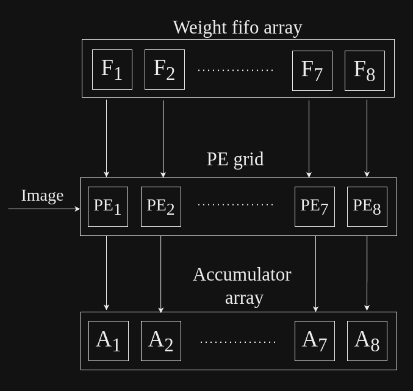

# Fully Connected:
Image and weights are loaded into fully connected layer from flattening layer and output of last convolution layer respectively.
This architecture consist of PE blocks, fifo and accumulators.

Below given is the architectural block diagram of fully connected layer:
    

## Description of working of fully connected:
1. **PE grid:**
   - Dimension of PE grid is 1 row and N columns, where, columns will be equal to number of bytes received from DDR, in a burst.
   - Weights coming from weight fifo array(present in fifo sharing module), are loaded into all the PE blocks together.
   - Image is broadcasted into all the PE blocks together, coming from flattening layer.
   - Product of image and weights are then sent as output fromthese proccesing element block.

2. **Accumulator array:**
   - Each PE block's output is stored in a accumulator, hence, there is one accumulator in each column of FC.
   - Once, it receives image dimension number of outputs, (i.e., 7x7x512, in case of VGG16), from PE blocks,
      the output is received, and valid accumulated output is sent out from accumulator array.